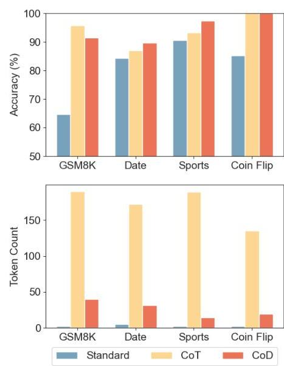

# Chain of Draft: Thinking Faster by Writing Less

*Source: [arXiv:2502.18600](https://arxiv.org/abs/2502.18600)*

*[Submitted on Tue, 25 Feb 2025 19:36:06 UTC]*

# Chain of Draft: Thinking Faster by Writing Less 

Silei Xu ${ }^{1}$, Wenhao Xie, Lingxiao Zhao, Pengcheng He<br>Zoom Communications


#### Abstract

Large Language Models (LLMs) have demonstrated remarkable performance in solving complex reasoning tasks through mechanisms like Chain-of-Thought (CoT) prompting, which emphasizes verbose, step-by-step reasoning. However, humans typically employ a more efficient strategy: drafting concise intermediate thoughts that capture only essential information. In this work, we propose Chain of Draft (CoD), a novel paradigm inspired by human cognitive processes, where LLMs generate minimalistic yet informative intermediate reasoning outputs while solving tasks. By reducing verbosity and focusing on critical insights, CoD matches or surpasses CoT in accuracy while using as little as only $7.6 \%$ of the tokens, significantly reducing cost and latency across various reasoning tasks. Our code and data are available at https://github.com/ sileix/chain-of-draft.


## 1 Introduction

Recent advances in reasoning models such as OpenAI o1 (OpenAI, 2024) and DeepSeek R1 (Guo et al., 2025) have propelled large language models (LLMs) to unprecedented performance on complex tasks using techniques like Chain of Thought (CoT) (Wei et al., 2022). This paradigm encourages models to break down problems into step-bystep explorations, mimicking the structured reasoning process of humans. While effective, this approach demands substantially more computational resources at inference time, leading to verbose outputs and higher latency. Such verbosity contrasts sharply with how humans typically approach problem-solving: we rely on concise drafts or shorthand notes to capture essential insights without unnecessary elaboration.

Motivated by this difference, we propose Chain of Draft (CoD), a novel prompting strategy that

[^0]

Figure 1: Comparison of Claude 3.5 Sonnet's accuracy and token usage across different tasks with three different prompt strategies: direct answer (Standard), Chain of Thought (CoT), and Chain of Draft (CoD). CoD achieves similar accuracy as CoT while using significant fewer tokens.
aligns more closely with human reasoning by prioritizing efficiency and minimalism. Instead of verbose intermediate steps, Chain of Draft encourages LLMs to generate concise, dense-information outputs at each step. This approach reduces latency and computational costs without sacrifice of accuracy, making LLMs more practical for real-world applications where efficiency is paramount.

The intuition behind Chain of Draft is rooted in how humans externalize thought. When solving complex tasks - whether solving mathematical problems, drafting essays, or coding - we often jot down only the critical pieces of information that help us progress. By emulating this behavior, LLMs can focus on advancing toward solutions without the overhead of verbose reasoning.


[^0]:    ${ }^{1}$ Correspondence to <silei. xu@zoom.us>

To evaluate the effectiveness of Chain of Draft, we conducted experiments across a variety of benchmarks requiring multi-step reasoning, including arithmetic reasoning, common sense reasoning, and symbolic reasoning. Our results demonstrate that this minimalist approach maintains or even improves accuracy compared with standard Chain of Thought, while significantly reducing token usage and latency.

The contributions of this paper are threefold:

- We introduce Chain of Draft, a concise reasoning prompting strategy inspired by human cognitive processes.
- We empirically validate that Chain of Draft can achieve significantly reduced latency and cost without sacrificing accuracy.
- We discuss the implications of Chain of Draft for LLM design, deployment, and real-world usability.


## 2 Related Work

## Structured Reasoning Frameworks for LLMs

Recently, a variety of reasoning language models have emerged, including o1 by OpenAI (OpenAI, 2024), QwQ by Alibaba (Team, 2024), and R1 by DeepSeek (Guo et al., 2025), demonstrating substantial improvements in tackling complex tasks. These models leverage structured reasoning methods to enhance robustness and problem-solving capabilities. The concept of Chain-of-Thought reasoning (CoT) (Wei et al., 2022; Kojima et al., 2022), established a foundational approach to reasoning in LLMs. Building on this foundation, more sophisticated topologies have emerged, such as tree (Yao et al., 2024; Chen et al., 2024a; Yu et al., 2023) and graph (Besta et al., 2024; Lei et al., 2023; Jiang et al., 2023), enabling LLMs to address increasingly intricate problems.

Other enhancements include self-consistency CoT (Wang et al., 2022), which incorporates verification and reflection mechanisms to bolster reasoning reliability, and ReAct (Yao et al., 2022), which integrates tool usage into the reasoning process, allowing LLMs to access external resources and knowledge. These innovations collectively expand the reasoning capabilities of LLMs across a diverse range of applications.
LLM Inference Latency Reduction Although structured reasoning greatly enhances LLMs' ability to solve complex questions, it significantly in-
creases the token usage before arriving at a final answer. This makes it challenging to apply in costsensitive and latency-sensitive scenarios (Wang et al., 2024). Furthermore, the model's lack of awareness regarding task complexity often leads to overthinking (Chen et al., 2024b; Chiang and Lee, 2024) even on simple tasks, resulting in unnecessary resource consumption.

Techniques like streaming aim to reduce perceived latency by incrementally providing partial outputs as they are generated, rather than waiting for the entire output sequence. However, this approach cannot fully mitigate overall latency or computational cost, and it is often unsuitable for chain-of-thought reasoning, as intermediate steps are often not intended to be shown to end users.

Ning et al. (2023) proposes Skeleton-of-Thought (SoT), a method that first guides LLMs to generate a skeleton outline of the answer, followed by parallel decoding to reduce latency. While SoT helps lower latency, it does not reduce computational cost and is limited to questions that can be parallelized effectively. Zhang et al. (2023) took a different approach, it first generates draft tokens at lower quality but higher speed through selective skipping of intermediate layers, and then validates the draft in a single forward pass. Our approach, CoD, can be combined with these approaches to further reduce the latency.

Hao et al. (2024) proposes Coconut to train LLMs to perform reasoning in a continuous latent space rather than in the traditional natural language space using the final hidden state of the LLM to represent the reasoning process. While Coconut reduces latency and computational cost, it suffers from reduced accuracy in complex tasks, such as GSM8k. Additionally, it loses the interpretability of natural language reasoning and cannot be applied to black-box models like GPT and Claude.

The works closest to ours are Concise Thoughts (CCoT) (Nayab et al., 2024) and token-budgetaware LLM reasoning (TALE) (Han et al., 2024). CCoT proposes using a fixed global token budget for reasoning steps. However, different tasks may require varying budgets to achieve the optimal balance between performance and cost. Moreover, LLMs may fail to adhere to an impractical budget, often generating far more tokens than intended (Han et al., 2024). Han et al. (2024) extends this idea by dynamically estimating a global token budget for different problems based on reasoning complexity. However, this approach requires an

additional LLM call to estimate the budget, which increases latency. Furthermore, it assumes that the model can accurately predict the complexity of requests, limiting its applicability to more complex tasks where reflection, self-correction, or external knowledge retrieval may be necessary during the reasoning process. In contrast, our approach employs a per-step budget, allowing unlimited reasoning steps, which makes it more adaptable to various structured reasoning techniques.

## 3 Chain-of-Draft Prompting

The Chain-of-Thought (CoT) prompting strategy has demonstrated significant effectiveness across a wide range of tasks, particularly those requiring complex multi-step reasoning. However, LLMs often produce excessively verbose reasoning steps, consuming a substantial number of tokens before arriving at a final answer. In contrast, humans tend to adopt a more concise approach when solving complex problems involving multi-step reasoning, such as mathematical or logical puzzles. Rather than elaborating on every detail, humans typically jot down only the essential intermediate results minimal drafts - to facilitate their thought processes. Inspired by this natural tendency, we propose a novel prompting strategy called Chain-ofDraft (CoD). This approach aims to reduce verbosity by limiting the number of words used in each reasoning step, focusing only on the essential calculations or transformations needed to progress.

To illustrate the difference between standard prompting, Chain-of-Thought prompting, and our proposed Chain-of-Draft prompting, consider the following simple arithmetic problem:
Q: Jason had 20 lollipops. He gave Denny some lollipops. Now Jason has 12 lollipops. How many lollipops did Jason give to Denny?

The response generated by a standard prompting approach directly outputs the answer, often without any reasoning. While correct, this lacks transparency in how the answer was derived, and requires the language model to run multi-step reasoning without any help from intermediate result, which often leads to hallucination.

```
Q: Jason had 20 lollipops. He gave Denny some
lollipops. Now Jason has 12 lollipops. How many
lollipops did Jason give to Denny?
A: 8
```

Chain-of-Thought prompting, on the other hand, provides a detailed reasoning process. While this
response is accurate and interpretable, it includes unnecessary details about Jason, Denny, and the lollipops, which are irrelevant to solving the mathematical problem. This verbosity inflates the token count and increases the response latency.

```
Q: Jason had 20 lollipops. He gave Denny some
lollipops. Now Jason has 12 lollipops. How many
lollipops did Jason give to Denny?
A: Let's think through this step by step:
1. Initially, Jason had 20 lollipops.
2. After giving some to Denny, Jason now has 12
lollipops.
3. To find out how many lollipops Jason gave to
Denny, we need to calculate the difference between
the initial number of lollipops and the remaining
number.
4. We can set up a simple subtraction problem:
Initial number of lollipops - Remaining number of
lollipops = Lollipops given to Denny
5. Putting in the numbers: 20 - 12 = Lollipops given
to Denny
6. Solving the subtraction: 20 - 12 = 8
Therefore, Jason gave 8 lollipops to Denny.
####
8 lollipops
```

By contrast, Chain-of-Draft prompting condenses the reasoning process into minimal, abstract representations. Here, the reasoning is distilled into a concise equation, focusing solely on the essential mathematical operation required to arrive at the solution. By abstracting away irrelevant contextual details, CoD significantly reduces the token count while maintaining transparency and correctness.

```
Q: Jason had 20 lollipops. He gave Denny some
lollipops. Now Jason has 12 lollipops. How many
lollipops did Jason give to Denny?
A: 20 - x = 12; x = 20 - 12 = 8. #### 8
```


## 4 Experiments

In empirical experiments, we follow the original CoT paper (Wei et al., 2022) to evaluate on 3 categories of tasks: arithmetic reasoning, commonsense reasoning, and symbolic reasoning. We pick representative tasks where original CoT significantly improves the accuracy over the baseline without reasoning. In particular, we pick GSM8k (Cobbe et al., 2021) for arithmetic reasoning; date understanding and sports understanding from BIG-bench (bench authors, 2023) for commonsense reasoning; and coin flip tasks introduced in the CoT paper (Wei et al., 2022) for symbolic reasoning.

### 4.1 Experimental Setup

We compare three different prompt strategies: CoT, CoD, and Standard prompting as a baseline.

Standard prompting. we use standard few-shot prompting (Brown et al., 2020), where the model is given input-output pairs as in-context examples. LLMs are asked to directly return the final answer, without any reasoning or explanation.
Chain-of-Thought. We follow the exact few-shot examples provided in the appendix of the CoT paper with the exception of having the final answer after four hashtags ( $\# \# \# \#$ ) for a more stable answer extraction.
Chain-of-Draft. In CoD, we also asked the model to think step by step. However, the model is asked to limit each reasoning step to five words at most. Note that we do not enforce such limitation in any way, it is just a general guideline to promote short reasoning steps. For each few-shot example, we also include the Chain of Draft written manually by the authors.

The complete system prompt for each prompting strategy is shown below.

| Answer the question directly. Do not return any <br> preamble, explanation, or reasoning. |  |
| :-- | :-- | :-- | :-- | :-- |

Chain-of-Thought
Think step by step to answer the following question. Return the answer at the end of the response after a separator \#\#\#\#.

## 4.1.1.1.1.1.1.1.1.1.1.1.1.1.1.1.1.1.1.1.1.1.1.1.1.1.1.1.1.1.1.1.1.1.1.1.1.1.1.1.1.1.1.1.1.1.1.1.1.1.1.1.1.1.1.1.1.1.1.1.1.1.1.1.1.1.1.1.1.1.1.1.1.1.1.1.1.1.1.1.1.1.1.1.1.1.1.1.1.1.1.1.1.1.1.1.1.1.1.1.1

| Model | Prompt | Accuracy | Token \# | Latency |
| :--: | :--: | :--: | :--: | :--: |
| GPT-4o | Standard | $90.0 \%$ | 1.0 | 0.4 s |
|  | CoT | $95.9 \%$ | 28.7 | 0.9 s |
|  | CoD | $98.3 \%$ | 15.0 | 0.7 s |
| Claude 3.5 <br> Sonnet | Standard | $90.6 \%$ | 1.0 | 0.9 s |
|  | CoT | $93.2 \%$ | 189.4 | 3.6 s |
|  | CoD | $97.3 \%$ | 14.3 | 1.0 s |

Table 3: Sports understanding evaluation results.
are asked to predict which side is up after a sequence of coin flip actions. Since the exact dataset is not published, we synthesize a test set of 250 examples following the same design. Specifically, we randomly chose 4 out of the top 1000 first names in the US region according to NameDataset (Remy, 2021) and randomly decided to flip the coin or not for each name. An example of the evaluation data is shown below.

```
Q: A coin is heads up. Robyn flips the coin. Peggy
flips the coin. Grant flips the coin. Vanessa does
not flip the coin. Is the coin still heads up?
A: No.
```

The evaluation results for GPT-4o and Claude 3.5 Sonnet are shown in Table 4. They achieve $73.2 \%$ and $85.2 \%$ with standard prompting, respectively. However, both models reach a perfect $100 \%$ accuracy with CoT and CoD. Again, CoD demonstrates significant reduction of tokens compared to CoT, from 68\% for GPT-4o to 86\% for Claude 3.5 Sonnet.

| Model | Prompt | Accuracy | Token \# | Latency |
| :--: | :--: | :--: | :--: | :--: |
| GPT-4o | Standard | 73.2\% | 1.0 | 0.4 s |
|  | CoT | 100.0\% | 52.4 | 1.4 s |
|  | CoD | 100.0\% | 16.8 | 0.8 s |
| Claude 3.5 <br> Sonnet | Standard | 85.2\% | 1.0 | 1.2 s |
|  | CoT | 100.0\% | 135.3 | 3.1 s |
|  | CoD | 100.0\% | 18.9 | 1.6 s |

Table 4: Coin flip evaluation results.

### 4.5 Limitaitons of CoD

## Inconsistency Without Few-shot Examples

We evaluated the performance of CoD under zeroshot setting, where no few-shot examples were provided. The results, presented in Table 5, indicate a significant decline in CoD's effectiveness. Notably, for Claude 3.5 Sonnet, CoD improved performance over direct answering by only $3.6 \%$. Additionally,
the token savings achieved by CoD are less significant compared to few-shot setting.

We hypothesize that this limitation arises due to the scarcity or absence of CoD-style reasoning patterns in the training data of large language models, making it a challenging task to generate concise and insightful "drafts" without guidance from fewshot examples.

| Model | Prompt | Accuracy | Token \# | Latency |
| :--: | :--: | :--: | :--: | :--: |
| GPT-4o | Standard | 56.9\% | 2.2 | 0.5 s |
|  | CoT | 94.8\% | 278.4 | 8.1 s |
|  | CoD | 84.4\% | 76.4 | 2.6 s |
| Claude 3.5 <br> Sonnet | Standard | 61.9\% | 5.2 | 0.9 s |
|  | CoT | 90.4\% | 248.8 | 3.5 s |
|  | CoD | 65.5\% | 73.7 | 1.6 s |

Table 5: Zero-shot GSM8K evaluation results.

## Reduced Performance on Small Models

We tested CoD on several small language models with fewer than 3B parameters, including Qwen2.5 1.5B/3B instruct (Yang et al., 2024), Llama 3.2 3B instruct (Dubey et al., 2024), and our in-house Zoom SLM 2.3B model (Zoom, 2025). While CoD effectively reduces the number of tokens required per response and improves accuracy over direct answer, its performance gap compared to CoT is more pronounced in these models.

Similar to the zero-shot setting, we suspect this is due to the absence of CoD-style data in the training process. We anticipate that fine-tuning these models with additional CoD-formatted data could significantly enhance their reasoning accuracy with CoD.

| Model | Prompt | Accuracy | Token \# |
| :--: | :--: | :--: | :--: |
| Qwen2.5-1.5B-Instruct | Standard | 5.7\% | 6.6 |
|  | CoT | 32.5\% | 141.4 |
|  | CoD | 24.2\% | 75.1 |
| Qwen2.5-3B-Instruct | Standard | 7.2\% | 3.4 |
|  | CoT | 59.1\% | 236.4 |
|  | CoD | 43.1\% | 41.2 |
| Llama3.2-3B-Instruct | Standard | 3.9\% | 16.6 |
|  | CoT | 70.7\% | 195.3 |
|  | CoD | 52.5\% | 98.1 |
| Zoom-SLM-2.3B | Standard | 5.9\% | 3.8 |
|  | CoT | 77.7\% | 129.0 |
|  | CoD | 50.9\% | 55.6 |

Table 6: GSM8K evaluation results on small language models.

## 5 Discussion

The latency issue has often been overlooked in studies of the reasoning capabilities of LLMs. However, it is crucial for lots of real-time applications to have low latency while maintaining high-quality responses. In this work, we propose Chain of Draft (CoD), a novel approach that substantially reduces the latency required for reasoning while achieving comparable or even superior accuracy compared to standard Chain-of-Thought prompting strategies. Unlike traditional methods that often involve lengthy reasoning steps, CoD leverages concise reasoning drafts to speed up response generation without sacrificing correctness.

Additionally, CoD offers significant cost advantages. By compacting the reasoning steps, it reduces the number of input tokens required for few-shot prompting and shortens the output token length, directly lowering computational cost. This token efficiency makes CoD especially appealing in cost-sensitive scenarios, such as large-scale deployments of LLMs or applications with strict budget constraints.

CoD demonstrates that effective reasoning in LLMs does not necessarily require lengthy outputs, offering an alternative approach where reasoning depth is maintained with minimal verbosity. Future work could explore combining CoD with other latency-reducing methods, such as adaptive parallel reasoning or multi-pass validation, to further optimize performance across different application domains. In addition, the principles behind the compact reasoning of CoD could inspire new strategies to improve reasoning models by training with compact reasoning data, while maintaining interpretability and efficiency in LLMs, helping bridge the gap between research-driven improvements in reasoning and the practical demands of real world systems.

## References

BIG bench authors. 2023. Beyond the imitation game: Quantifying and extrapolating the capabilities of language models. Transactions on Machine Learning Research.

Maciej Besta, Nils Blach, Ales Kubicek, Robert Gerstenberger, Michal Podstawski, Lukas Gianinazzi, Joanna Gajda, Tomasz Lehmann, Hubert Niewiadomski, Piotr Nyczyk, et al. 2024. Graph of thoughts: Solving elaborate problems with large language models. In Proceedings of the AAAI Conference on Artificial Intelligence, volume 38, pages 17682-17690.

Tom Brown, Benjamin Mann, Nick Ryder, Melanie Subbiah, Jared D Kaplan, Prafulla Dhariwal, Arvind Neelakantan, Pranav Shyam, Girish Sastry, Amanda Askell, Sandhini Agarwal, Ariel Herbert-Voss, Gretchen Krueger, Tom Henighan, Rewon Child, Aditya Ramesh, Daniel Ziegler, Jeffrey Wu, Clemens Winter, Chris Hesse, Mark Chen, Eric Sigler, Mateusz Litwin, Scott Gray, Benjamin Chess, Jack Clark, Christopher Berner, Sam McCandlish, Alec Radford, Ilya Sutskever, and Dario Amodei. 2020. Language models are few-shot learners. In Advances in Neural Information Processing Systems, volume 33, pages 1877-1901. Curran Associates, Inc.

Sijia Chen, Baochun Li, and Di Niu. 2024a. Boosting of thoughts: Trial-and-error problem solving with large language models. arXiv preprint arXiv:2402.11140.

Xingyu Chen, Jiahao Xu, Tian Liang, Zhiwei He, Jianhui Pang, Dian Yu, Linfeng Song, Qiuzhi Liu, Mengfei Zhou, Zhuosheng Zhang, et al. 2024b. Do not think that much for $2+3=$ ? on the overthinking of o1-like llms. arXiv preprint arXiv:2412.21187.

Cheng-Han Chiang and Hung-yi Lee. 2024. Overreasoning and redundant calculation of large language models. arXiv preprint arXiv:2401.11467.

Karl Cobbe, Vineet Kosaraju, Mohammad Bavarian, Mark Chen, Heewoo Jun, Lukasz Kaiser, Matthias Plappert, Jerry Tworek, Jacob Hilton, Reiichiro Nakano, Christopher Hesse, and John Schulman. 2021. Training verifiers to solve math word problems. arXiv preprint arXiv:2110.14168.

Abhimanyu Dubey, Abhinav Jaubri, Abhinav Pandey, Abhishek Kadian, Ahmad Al-Dahle, Aiesha Letman, Akhil Mathur, Alan Schelten, Amy Yang, Angela Fan, et al. 2024. The llama 3 herd of models. arXiv preprint arXiv:2407.21783.

Daya Guo, Dejian Yang, Haowei Zhang, Junxiao Song, Ruoyu Zhang, Runxin Xu, Qihao Zhu, Shirong Ma, Peiyi Wang, Xiao Bi, et al. 2025. Deepseek-r1: Incentivizing reasoning capability in llms via reinforcement learning. arXiv preprint arXiv:2501.12948.

Tingxu Han, Chunrong Fang, Shiyu Zhao, Shiqing Ma, Zhenyu Chen, and Zhenting Wang. 2024. Token-budget-aware llm reasoning. arXiv preprint arXiv:2412.18547.

Shibo Hao, Sainbayar Sukhbaatar, DiJia Su, Xian Li, Zhiting Hu, Jason Weston, and Yuandong Tian. 2024. Training large language models to reason in a continuous latent space. arXiv preprint arXiv:2412.06769.

Song Jiang, Zahra Shakeri, Aaron Chan, Maziar Sanjabi, Hamed Firooz, Yinglong Xia, Bugra Akyildiz, Yizhou Sun, Jinchao Li, Qifan Wang, et al. 2023. Resprompt: Residual connection prompting advances multi-step reasoning in large language models. arXiv preprint arXiv:2310.04743.

Takeshi Kojima, Shixiang Shane Gu, Machel Reid, Yutaka Matsuo, and Yusuke Iwasawa. 2022. Large language models are zero-shot reasoners. Advances in neural information processing systems, 35:2219922213.

Bin Lei, Chunhua Liao, Caiwen Ding, et al. 2023. Boosting logical reasoning in large language models through a new framework: The graph of thought. arXiv preprint arXiv:2308.08614.

Sania Nayab, Giulio Rossolini, Giorgio Buttazzo, Nicomaria Manes, and Fabrizio Giacomelli. 2024. Concise thoughts: Impact of output length on llm reasoning and cost. arXiv preprint arXiv:2407.19825.

Xuefei Ning, Zinan Lin, Zixuan Zhou, Zifu Wang, Huazhong Yang, and Yu Wang. 2023. Skeleton-ofthought: Large language models can do parallel decoding. Proceedings ENLSP-III.

OpenAI. 2024. Openai ol system card. Accessed: 2024-12-01.

Philippe Remy. 2021. Name dataset. https://github. com/philipperemy/name-dataset.

Qwen Team. 2024. Qwq: Reflect deeply on the boundaries of the unknown.

Junlin Wang, Siddhartha Jain, Dejiao Zhang, Baishakhi Ray, Varun Kumar, and Ben Athiwaratkun. 2024. Reasoning in token economies: Budget-aware evaluation of llm reasoning strategies. arXiv preprint arXiv:2406.06461.

Xuezhi Wang, Jason Wei, Dale Schuurmans, Quoc Le, Ed Chi, Sharan Narang, Aakanksha Chowdhery, and Denny Zhou. 2022. Self-consistency improves chain of thought reasoning in language models. arXiv preprint arXiv:2203.11171.

Jason Wei, Xuezhi Wang, Dale Schuurmans, Maarten Bosma, brian ichter, Fei Xia, Ed Chi, Quoc V Le, and Denny Zhou. 2022. Chain-of-thought prompting elicits reasoning in large language models. In Advances in Neural Information Processing Systems, volume 35, pages 24824-24837. Curran Associates, Inc.

An Yang, Baosong Yang, Beichen Zhang, Binyuan Hui, Bo Zheng, Bowen Yu, Chengyuan Li, Dayiheng Liu, Fei Huang, Haoran Wei, et al. 2024. Qwen2. 5 technical report. arXiv preprint arXiv:2412.15115.

Shunyu Yao, Dian Yu, Jeffrey Zhao, Izhak Shafran, Tom Griffiths, Yuan Cao, and Karthik Narasimhan. 2024. Tree of thoughts: Deliberate problem solving with large language models. Advances in Neural Information Processing Systems, 36.

Shunyu Yao, Jeffrey Zhao, Dian Yu, Nan Du, Izhak Shafran, Karthik Narasimhan, and Yuan Cao. 2022. React: Synergizing reasoning and acting in language models. arXiv preprint arXiv:2210.03629.

Junchi Yu, Ran He, and Rex Ying. 2023. Thought propagation: An analogical approach to complex reasoning with large language models. arXiv preprint arXiv:2310.03965.

Jun Zhang, Jue Wang, Huan Li, Lidan Shou, Ke Chen, Gang Chen, and Sharad Mehrotra. 2023. Draft \& verify: Lossless large language model acceleration via self-speculative decoding. arXiv preprint arXiv:2309.08168.

Zoom. 2025. How we're preparing for the next era of AI. https://www.zoom.com/en/blog/ what-is-agentic-ai.

---
*[BibTeX citation](chain-of-draft-thinking-faster-by-writing-less.bib)*
