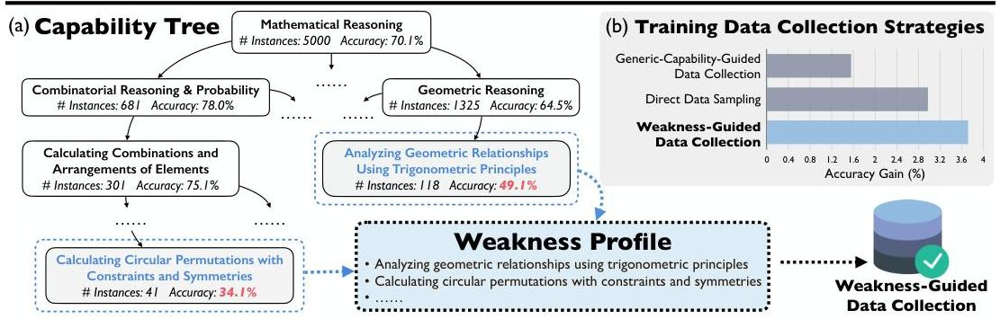
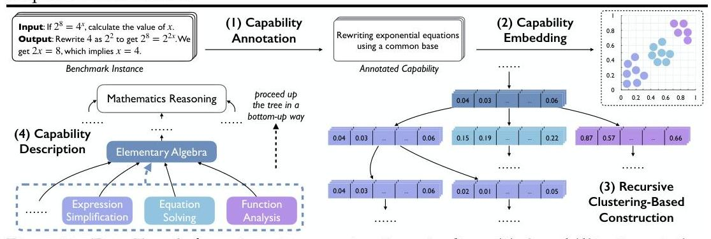
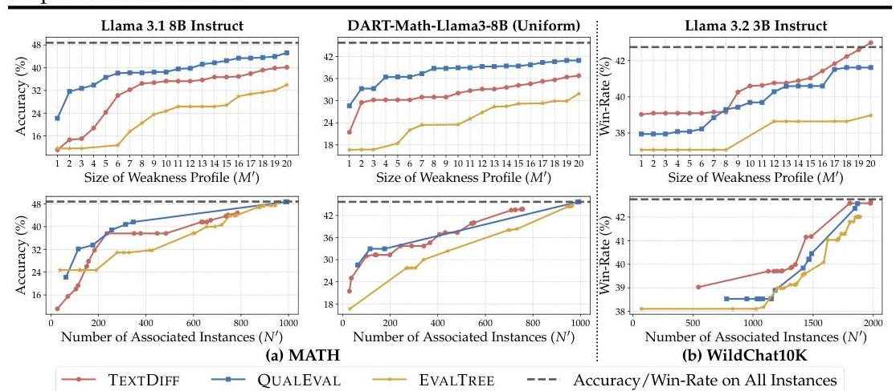
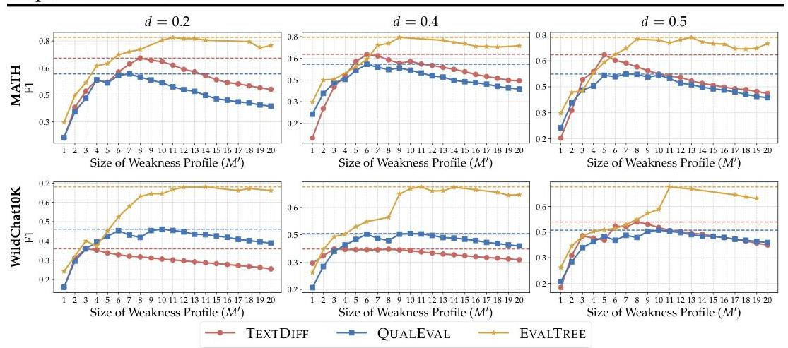
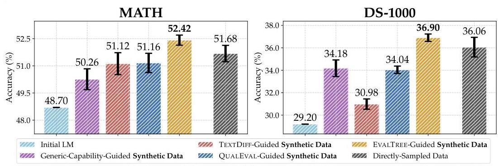

# EvalTree: Profiling Language Model Weaknesses via Hierarchical Capability Trees

*Source: [arXiv:2503.08893](https://arxiv.org/abs/2503.08893)*

*[Submitted on Tue, 11 Mar 2025 21:12:48 UTC]*

# EVALTREE: Profiling Language Model Weaknesses via Hierarchical Capability Trees 

Zhiyuan Zeng ${ }^{\odot}$ Yizhong Wang ${ }^{\odot \boldsymbol{\Delta}}$ Hannaneh Hajishirzi ${ }^{\odot} \boldsymbol{\Delta}$ Pang Wei Koh ${ }^{\odot \boldsymbol{\Delta}}$<br>${ }^{\ominus}$ Paul G. Allen School of Computer Science \& Engineering, University of Washington<br>${ }^{\Delta}$ Allen Institute for Artificial Intelligence zyzeng@cs.washington.edu


#### Abstract

An ideal model evaluation should achieve two goals: identifying where the model fails and providing actionable improvement guidance. Toward these goals for Language Model (LM) evaluations, we formulate the problem of generating a weakness profile, a set of weaknesses expressed in natural language, given an LM's performance on every individual instance in a benchmark. We introduce a suite of quantitative assessments to compare different weakness profiling methods. We also introduce a weakness profiling method EvalTree. It constructs a capability tree where each node represents a capability described in natural language and is linked to a subset of benchmark instances that specifically evaluate this capability; it then extracts nodes where the LM performs poorly to generate a weakness profile. On the MATH and WildChat benchmarks, we show that EVALTREE outperforms baseline weakness profiling methods by identifying weaknesses more precisely and comprehensively. Weakness profiling further enables weakness-guided data collection, and training data collection guided by EVALTREE-identified weaknesses improves LM performance more than other data collection strategies. We also show how EVALTREE exposes flaws in Chatbot Arena's human-voter-based evaluation practice. To facilitate future work, we release our code and an interface that allows practitioners to interactively explore the capability trees built by EVALTREE.


Code and Data github.com/Zhiyuan-Zeng/EvalTree
Web Interface zhiyuan-zeng.github.io/EvalTree

## 1 Introduction

An ideal model evaluation ought to achieve the goals of (1) identifying where the evaluated model fails in a human-interpretable way, and (2) providing actionable guidance to improve the model (Liang et al., 2023; Holtzman et al., 2023; Saxon et al., 2024). However, current model evaluations commonly treat diverse instances in a benchmark uniformly, reducing model performance to a single aggregate metric or coarse-grained, category-level metrics at best. Doing so obscures the reality that a benchmark is heterogeneous, which evaluates diverse capabilities at varying granularities through specific instances, and that model performance can vary significantly across these capabilities. For example, on the MATH benchmark (Hendrycks et al., 2021b), GPT-40 mini (OpenAI, 2024a) achieves an accuracy of $75.1 \%$ when calculating combinations and arrangements of elements, but only $49.1 \%$ when analyzing geometric relationships using trigonometric principles, as shown in Figure 1(a). As a result, current model evaluations often fail to achieve the two evaluation goals.
Inspired by the preceding observation, we formulate the problem of generating a weakness profile, a set of natural language descriptions of a model's weaknesses, given the model's performance on every individual benchmark instance. We focus on profiling Language Model (LM) weaknesses (Figure 1(a)). A weakness (e.g., "analyzing geometric relationships using trigonometric principles") is a capability where the LM performs poorly in instances that test for this capability. Weakness profiles advance both goals of model evaluation: (1) they provide LM developers and users with an intuitive takeaway to interpret an LM's



Figure 1: (a) EVALTREE automatically constructs a capability tree given an LM's performance on every individual benchmark instance, and then generates a weakness profile by extracting nodes with statistically low performance (weakness profiling). (b) Training data collection guided by weakness profiling effectively improves LM performance, e.g., achieving a $2.5 \times$ accuracy gain on MATH compared to being guided by a generic capability.
heterogeneous performance across diverse capabilities; and (2) they are actionable, e.g., model developers can collect targeted training data to address the identified weaknesses.

In terms of how to profile LM weaknesses, manually analyzing LM performance on all instances is becoming increasingly unrealistic. This is because LM benchmarks are growing in complexity to match the expanding versatility of emerging LMs; moreover, the latest benchmarks such as Chatbot Arena (Chiang et al., 2024) collect real-world human-LM interactions, leading to the emergence of unknown capabilities (Tamkin et al., 2024) tested within a benchmark and thus further complicating manual efforts. Some works thus attempt to automatically profile LM weaknesses by constructing a single-level capability categorization across all benchmark instances and identifying low-performing categories (Murahari et al., 2024; Moayeri et al., 2024); however, fixed-granularity categorizations could be either too broad to provide precise diagnoses or too specific to retain high-level interpretability. More critically, while some methods, including those mentioned above, have been qualitatively shown to identify LM weaknesses, there is no existing study to compare them quantitatively.
To overcome these challenges, we establish a standard for what an ideal weakness profile should achieve and introduce a suite of quantitative assessments. We then propose EVALTREE, a weakness profiling method that automatically constructs a hierarchical tree for any LM benchmark, where each node represents a capability described in natural language and is linked to a subset of instances that specifically evaluate this capability. Instances linked to each node are partitioned into subsets corresponding to children's capabilities, which are further subdivided into more specific, finer-grained sub-capabilities at successive levels of the children's subtrees. EVALTREE then evaluates an LM's performance at every tree node, providing a capability tree. To generate a weakness profile, EVALTREE extracts tree nodes with statistically low performance and takes their capability descriptions (Figure 1(a)).

Our experiments show that EVALTREE advances both evaluation goals via weakness profiling: (1) EVALTREE profiles LM weaknesses more precisely and comprehensively than existing methods on the MATH and WildChat (Zhao et al., 2024a) benchmarks; (2) synthetic data generation guided by EVALTREE-identified weaknesses effectively improves LM performance, e.g., achieving a $2.5 \times$ accuracy gain on MATH compared to being guided by a generic capability (Figure 1(b)). Furthermore, we show how EVALTREE uncovers abnormal LM rankings in Chatbot Arena, exposing flaws in its human-voter-based evaluation practice. We also provide an interface that lets practitioners interactively explore capability trees to facilitate future work. Finally, we discuss future directions, including improving capability tree construction and leveraging capability trees for various potential applications.

# 1.1 Related Work 

Some prior work explores how to identify LM weaknesses by constructing custom instance sets to specifically highlight underperforming areas (Ribeiro \& Lundberg, 2022; Gao et al., 2023; Li et al., 2024). In contrast, we operate entirely on existing benchmarks and emphasize interpretability. In terms of methodology, while EVALTREE automatically constructs a tree to organize instances in a dataset, a small number of datasets are released with similar hierarchical structures defined by their creators. For example, several datasets provide

shallow trees, e.g., a two-layer taxonomy (Wang et al., 2022; Bai et al., 2024; Zhong et al., 2024a); some adopt existing trees to guide data collection, such as ImageNet (Deng et al., 2009) using WordNet (Miller, 1994) and iNat2017 (Horn et al., 2018) using a biological taxonomy. Some prior work also studies structured capability categorization, the essential idea behind EVALTREE; e.g., QualEval (Murahari et al., 2024) and Skill-Slices (Moayeri et al., 2024) propose LM-based pipelines to automatically categorize benchmark instances into capability groups, providing single-level capability categorization structures. Most related to our work, Wang et al. (2023); Zhong et al. (2024b) suggest recursively clustering instances in a dataset to construct trees, and Anthropic's internal system Clio (Tamkin et al., 2024) employs Claude to build trees of human-LM conversations based on specific attributes or characteristics (e.g., topic). However, these techniques either incur prohibitively high LM usage costs or do not release key implementation details and source code, making them difficult to use. Most importantly, those works do not demonstrate how methods based on their trees can be quantitatively compared with other methods on concrete problems.

# 2 LM Weakness Profiles 

### 2.1 Definition and Desiderata

The problem of identifying LM weaknesses is broad. In this paper, we define a weakness profile in the simplest way that aligns with the two goals of identifying where an LM fails and providing improvement guidance. We let $\mathcal{C}$ denote the set of all possible natural language descriptions and assume an underlying data distribution $\mathcal{D}$. A weakness profile for an LM on a given benchmark drawn from the distribution $\mathcal{D}$ is a set $W=\left\{w_{1}, w_{2}, \ldots, w_{M}\right\} \subset \mathcal{C}$, where $M$ can vary among different profiles, and each identified weakness $w_{i} \in W$ is a natural language description of a capability, such as "analyzing geometric relationships using trigonometric principles." An ideal weakness profile $W$ satisfies three (informal) desiderata:

1. Low-performance identification (precision): The LM should exhibit low performance on instances (sampled from $\mathcal{D}$ ) testing for each identified weakness.
2. Comprehensive coverage (comprehensiveness): $W$ should reflect weaknesses that can be captured from the LM's performance on $\mathcal{D}$ as comprehensively as possible.
3. Appropriate granularity: Each $w_{i}$ should avoid being overly specific or generic.

We introduce concrete assessments in the next subsection to quantitatively compare weakness profiles along these desiderata and introduce experimental details in Section 5.
A weakness profiling method takes as input an LM's evaluation result on a given benchmark of size $N$ sampled from the data distribution $\mathcal{D}$, represented as a vector $g \in \mathbb{R}^{N}$, where each $g_{i}$ denotes the performance metric achieved by the LM on the $i$-th instance. We refer to this instance set as the profiling set. Since "weakness" is inherently a relative concept, a weakness profiling method should also include a user-tunable hyperparameter $\tau$ to control strictness, where a higher $\tau$ results in weaknesses being identified at higher performance levels. For example, one might set $\tau$ higher to focus on general areas for improvement, while another might adjust $\tau$ lower to find the LM's extreme failures. When referring to a specific method in context, we denote $W_{\tau}$ as the weakness profile generated with a given $\tau$.

### 2.2 Assessment for Comparing Weakness Profiles

We assume the existence of a test set sampled from the data distribution $\mathcal{D}$. We denote the LM's evaluation result vector on this test set as $f$, analogous to $g$ defined above for the profiling set. We also define the LM's performance metric over a set of instance indices $S$ as $F(S)=\sum_{x \in S} f_{x} /|S|$, assuming that the performance metric can be averaged; for example, each $f_{i}$ might be a binary value $(0 / 1)$ indicating whether the LM correctly solved the $i$-th instance, in which case $F(S)$ is the accuracy of the LM on the set $S$. Furthermore, given a capability description $c \in \mathcal{C}$, we call an instance that tests for this capability an associated instance of $c$, with the index set of all associated instances in the test set denoted as $A(c)$. In our experiments, we prompt an LM to determine whether a given instance is an associated instance of a capability $c$ to get $A(c)$, with further details in Appendix E.1.

We introduce two assessments below to measure the effectiveness of a weakness profile in the first evaluation goal of identifying where an LM fails, based on the three desiderata.

Low-Performance Identification Assessment. To measure desideratum 1, i.e., lowperformance identification, we measure how low $\sum_{w_{i} \in W} F\left(A\left(w_{i}\right)\right) /|W|$ can be, i.e., the (average) performance metric on instances that test for an identified weakness $w_{i}$. Denoting $S=\bigcup_{w_{i} \in W} A\left(w_{i}\right)$, we also compare how low $F(S)$ can be, i.e., the performance metric on all instances that test for at least one weakness in $W$. In the two cases, a lower value indicates weaker performance in the identified weaknesses, which can better satisfy desideratum 1.

Ground-Truth Weakness Assessment. To measure all three desiderata, inspired by Zhong et al. (2023), we generate a synthetic evaluation result for a "hypothetical" LM's performance on the profiling set. We use synthetic evaluation results rather than evaluation results of real LMs because desideratum 2, i.e., comprehensive coverage, cannot be reliably measured without prior knowledge of the LM's true weaknesses, which is exactly the problem we are trying to solve; by generating a synthetic evaluation result, we can control the groundtruth weaknesses, allowing for a rigorous assessment. We start with a predefined groundtruth weakness profile $W^{*}=\left\{w_{1}^{*}, w_{2}^{*}, \ldots, w_{M^{*}}^{\prime}\right\}$. Then, we sample each $g_{i}$, i.e., the LM's performance metric on the $i$-th benchmark instance (in the profiling set), ensuring that instances associated with weaknesses in $W^{*}$ exhibit systematically lower performance than other instances; specifically, we independently sample each $g_{i}$ such that instances associated with weaknesses in $W^{*}$ tend to have lower values of $g_{i}$ than other instances. Finally, to assess a weakness profile $W$, we measure its alignment with $W^{*}$ based on the overlap of associated instances in the test set; we restrict $|W|$ to values that are not significantly larger than $\left|W^{*}\right|$, preventing methods from inflating scores by generating overly specific descriptions that increase $|W|$, which would violate desideratum 3, i.e., appropriate granularity.

Extrinsic Assessment: Weakness-Guided Training Data Collection. We examine the effectiveness of a weakness profile in supporting the second evaluation goal of improving the evaluated LM. In real-world scenarios, LM developers collect additional finetuning data and perform continual training to further improve an LM. A common strategy is to collect data guided by a generic capability such as "mathematical reasoning". We hypothesize that a weakness-guided strategy, wherein a weakness profile for the LM is used as actionable guidance for targeted data collection, may be more effective by directly addressing where the LM fails. For a controlled comparison, we collect data by synthetic data generation and compare LMs trained on data generated with different weakness profiles.

# 3 EVALTREE: A Tree-Based Method for Profiling LM Weaknesses 

### 3.1 Automatic Construction of Capability Trees

EVALTREE constructs a capability tree automatically. EVALTREE first constructs a tree that hierarchically organizes and interprets the capabilities tested within a benchmark. Each tree node represents a specific capability expressed in natural language and is linked to a subset of benchmark instances that evaluate this capability. The root node is linked to all instances, and each node's children together partition instances linked to it into subsets corresponding to more specific sub-capabilities, as shown in Figure 1(a). Finally, every leaf corresponds one-to-one with an individual instance; it is worth noting that instances linked to each node are exactly the leaves in its subtree. We propose an automatic four-stage tree construction pipeline, which takes all instances of a benchmark as input, as shown in Figure 2.

Stage (1) Capability Annotation identifies the specific capability description required for each benchmark instance by prompting an LM, a practice also adopted in previous work analyzing LM capabilities (Ouyang et al., 2023; Didolkar et al., 2024; Kaur et al., 2024). The LM is asked to not mention the instance's specific content. See Figure 2 for an example.

Stage (2) Capability Embedding uses an off-the-shelf sentence embedding model to generate a capability embedding for each annotated capability from the stage (1).
Stage (3) Recursive Clustering-Based Construction recursively builds the hierarchical structure of the tree, starting from the root node linked to all instances. For each node,



Figure 2: EVALTREE's four-stage tree construction pipeline. (1) Capability Annotation prompts an LM to identify a natural language description of each instance's capability. (2) Capability Embedding maps instances to a vector space using sentence embeddings of their annotated capabilities. (3) Recursive Clustering-Based Construction builds the tree by clustering capability embeddings using K-Means recursively. (4) Capability Description assigns each node a natural language summary of its children's capabilities using an LM.
we cluster the capability embeddings of instances linked to it using K-Means (MacQueen, 1967). We iterate over cluster numbers from 2 to a predefined maximum value and select the one that yields the highest Silhouette score (Rousseeuw, 1987). This practice follows Katz et al. (2024), which also determines the cluster number automatically when the value is not predefined. Each cluster in the selected clustering becomes the set of instances linked to a newly created child node. The process continues recursively for each (non-leaf) child node.
Stage (4) Capability Description assigns a natural language description to each tree node to interpretably specify the capability represented by this node. For each leaf node (instance), we take its annotated capability directly as its capability description. For non-leaf nodes, we describe their capabilities at progressive granularities by proceeding up the tree in a bottom-up way, prompting an LM to summarize the capabilities of a node's children into a natural language description that captures their overarching scope; the LM's output is prompted to cover all children's capabilities without introducing extraneous concepts.
After constructing the tree, EVALTREE then provides a capability tree by evaluating LM performance at every node. Since each node is linked to a subset of benchmark instances, an evaluation practice can be seamlessly applied to this subset. For example, metrics such as accuracy or win-rate (Dubois et al., 2023) can be computed on instances linked to each node. See Appendix A and G for more details and an alternative tree construction approach.

# 3.2 Generating a Weakness Profile from the Capability Tree 

EVALTREE generates an LM weakness profile by extracting nodes where the LM's performance metric is significantly below a user-tunable threshold $\tau$; for clarity, we consider the specific case of correctness-based accuracy being the metric. The extraction algorithm traverses the capability tree from the root to the leaves (for further details, see Appendix B):

1. Statistical Test. At each visited node, we perform a binomial test to determine whether its accuracy is significantly lower than $\tau$. The test uses the number of linked instances as the total sample size and the number of correctly solved instances as the count of successes. We apply the same test to the node's direct children.
2. Node Extraction. A visited node is extracted if: (a) it passes the test described above, and (b) all its direct children with sufficient instances (determined by a hyperparameter threshold of number) also pass the test. The design of (b) aims to identify the weakness at a granularity that is sufficiently specific. For example, if "algebra" performs statistically below the threshold overall but the LM performs well on its "four-operations" child while performing poorly on "abstract algebra," identifying "algebra" as a weakness obscures the fact that the real weakness might lie in "abstract algebra" (or other sub-capabilities); here, further traversal is required.
3. Stopping Criteria. Traversal stops at a node if: (a) its instance number is smaller than a hyperparameter threshold, or (b) the node has been extracted.

Finally, the nodes extracted from running the algorithm are non-overlapping, i.e., no instance (leaf node) is linked to more than one extracted node. The final weakness profile consists of

the capability descriptions of the extracted nodes. By adjusting the meaning of "count of successes" in the statistical test, this algorithm also supports various metrics and can identify strengths (performance above a threshold). Note that setting a significance threshold of $1-\alpha$ at each node's statistical test does not guarantee an overall $1-\alpha$ confidence level across all tests conducted at multiple nodes since we do not correct the tests for multiple comparisons; we address this by incorporating any adjustments into the choice of $\tau$.

# 4 Baseline Methods for Profiling LM Weaknesses 

We describe the baseline methods, which are representative of existing methods that have been qualitatively shown to profile LM weaknesses. See Appendix D for additional details.
TextDifF. TextDifF (Zhong et al., 2022) is an LM-based method that automatically describes differences between two text distributions in natural language. While not originally designed for weakness profiling, prior work has used it to describe distributional differences between two instance sets. We adapt this method by comparing instances where the evaluated LM fails versus succeeds, using the described differences to identify its weaknesses. Specifically, we randomly sample two sets of instances: those where the evaluation result indicates that the evaluated LM has failed, and those where it has succeeded. We then prompt a diagnostic LM using the sampled instances to output a predefined number of potential weaknesses that might cause the evaluated LM to struggle. We compute the performance on the associated instances in the profiling set (Section 2.2) for each potential weakness and select those with the lowest performance metrics as the weakness profile. Note that this step actually gives TextDifF an unfair advantage over other methods in our experiments, as it uses the same implementation used by the method assessment to determine associated instances; however, a method should not have access to this information in principle, such as which LM is used or what prompt is used for method assessment.
QuALEVAL. QuALEVAL (Murahari et al., 2024) uses an automatic LM-based pipeline to derive a predefined number of capabilities (e.g., 20) described in natural language from all benchmark instances. The method then applies a linear programming algorithm to assign each benchmark instance to some of the derived capabilities. Finally, it outputs a single-level capability categorization structure. We compute the performance metric on all instances assigned to each capability and identify a set of weaknesses as the weakness profile by selecting capabilities with the lowest performance metrics.

In these two methods, $\tau$ could be either the size of the weakness profile or a performance metric threshold, and the two can be transformed interchangeably.

## 5 Experimental Results

We now present the results of our experiments that compare all weakness profiling methods, i.e., those introduced in Section 4 and EVALTREE, using the three assessments for weakness profiles introduced in Section 2.2. As preparation for the first two assessments, for each method, we sweep over $\tau$ to obtain a collection of all distinct weakness profiles $\left\{W_{\tau_{1}}, W_{\tau_{2}}, \ldots\right\}$, where each profile is included only once even if generated by multiple $\tau$.

### 5.1 Low-Performance Identification Assessment

Low-Performance Identification Assessment compares how low LM performance is in weaknesses identified by different methods. We assess all weakness profiling methods on the MATH (Hendrycks et al., 2021b) and WildChat10K (a subset we curated from WildChat (Zhao et al., 2024a)) benchmarks and randomly split each benchmark into profiling/test sets (see Appendix C for more configuration details). We constrain the minimum weakness profile size to compare the average performance across identified weaknesses and constrain the minimum number of associated instances to compare overall performance on all associated instances. To visualize the comparisons, we plot two curves in Figure 3: one with the minimum profile size $M^{\prime}$ (ranging from 1 to 20) on the $x$-axis



Figure 3: Comparison of weakness profiling methods using Low-Performance Identification Assessment. The first row shows how the average LM performance across identified weaknesses changes as we vary the minimum weakness profile size $M^{\prime}$. The second row shows how the overall performance on all associated instances changes as we vary the minimum number of associated instances $N^{\prime}$. Experiments in (a) were conducted on MATH with Llama 3.1 8B Instruct (Dubey et al., 2024) and DART-Math-Llama3-8B (Uniform) (Tong et al., 2024), and experiments in (b) were conducted on WildChat10K, where the win-rate is the percentage of instances in which Llama 3.2 3B Instruct (Meta, 2024) is preferred over Gemma 2 IT 2B (Rivière et al., 2024). A lower curve indicates more precise identification of true low-performing weaknesses and EVALTREE consistently achieves the lowest curve.
and $\min \left\{\sum_{w_{i} \in W_{\tau}} F\left(A\left(w_{i}\right)\right) /\left|W_{\tau}\right| \mid \forall \tau,\left|W_{\tau}\right| \geq M^{\prime}\right\}$ on the y-axis, and another with the minimum associated instance number $N^{\prime}$ (ranging from 1 to the test set size) on the x -axis and $\min \left\{F\left(S_{\tau}\right) \mid \forall \tau,\left|S_{\tau}\right| \geq N^{\prime}\right\}$ on the y -axis, where $S_{\tau}=\bigcup_{w_{i} \in W_{\tau}} A\left(w_{i}\right)$. EVALTREE consistently achieves the lowest curve, demonstrating its superior precision in capturing true weaknesses compared to other methods. See Appendix E. 2 for qualitative analysis.

# 5.2 Ground-Truth Weakness Assessment 

Ground-Truth Weakness Assessment compares how precisely and comprehensively different weakness profiling methods capture ground-truth weaknesses on synthetic LM evaluation results with appropriate description granularities. We manually curated 10 ground-truth weaknesses at various granularities for MATH and WildChat10K. For each benchmark, we generated three synthetic evaluation results by sampling with different hyperparameters that shape the probability distribution. For a given weakness profile, we compute the F1 score based on the overlap of associated instances to measure both precision and comprehensiveness relative to the ground-truth weakness profile $W^{*}$. We plot a curve with $M^{\prime}$ (ranging from 1 to 20 ) on the x -axis and the F1 score of $W_{\tau}$, where $\left|W_{\tau}\right|=M^{\prime 1}$, on the y-axis. All curves are shown in Figure 4 and Appendix E.3.3. We observe that for most $M^{\prime}$, the F1 scores achieved by EVALTREE surpass the highest F1 scores obtained by the other two methods. For additional details and analysis, see Appendix E.3.1 and E.3.2.

### 5.3 Extrinsic Assessment: Weakness-Guided Training Data Collection

Extrinsic Assessment compares how effectively weakness profiles from different methods guide targeted data collection to improve the evaluated LM; here, we conducted proof-ofconcept experiments using a data-generation LM to generate (synthetic) data inputs (Kim et al., 2024) for data collection. The generic-capability-guided data collection strategy uses a description of the targeted benchmark's overall capability as guidance. For each weakness profiling method, we have a corresponding data collection strategy that randomly samples an identified weakness (in the weakness profile generated by the method) as guidance for generating each data input. For context, we also included the result in which training data inputs were directly sampled from the profiling set; however, we emphasize that this

[^0]
[^0]:    ${ }^{1}$ If multiple thresholds $\tau$ for EVALTREE result in the same profile size, we select the lowest $\tau$. Note that the same profile size does not necessarily imply identical weakness profiles.



Figure 4: Comparison of weakness profiling methods using Ground-Truth Weakness Assessment. The plot shows F1 score curves of TextDifF, QuALEVAL, and EVALTREE, where the weakness profile size varies from 1 to 20 ; the F1 score measures how precisely and comprehensively ground-truth weaknesses are captured. A horizontal line indicates each method's highest score. $d$ is a hyperparameter to control the sampling probability.
strategy has an inherently unfair advantage due to its distributional match to the test set and is not a direct point of comparison in our proof-of-concept experiments, which focus on LM developers' real-world practice of collecting new finetuning data.
We started with Llama 3.1 8B Instruct (Dubey et al., 2024) for MATH and DeepSeek-CoderBase 6.7B (Guo et al., 2024) for DS-1000 (Lai et al., 2023), following configurations in Appendix C. When generating an input, we randomly sampled 5 inputs from the profiling set as in-context examples for the data-generation LM. We compared the performance of different LMs on the test set. For all data collection strategies, we collected the same amount of finetuning data inputs, with the output produced by separately feeding the input to the data-generation LM. Refer to Appendix E. 4 for more details. The results in Figure 5 demonstrate that the LM trained on EVALTREE-guided synthetic data significantly outperformed other LMs. Notably, the EvalTREE-guided data collection strategy even slightly outperformed directly sampling data from the profiling set. Therefore, EvalTREE can provide effective, targeted signals to guide data collection to improve LM performance.

# 5.4 LM Usage Cost Comparison 

EVALTREE also incurs significantly lower LM usage costs than other methods. When each method identifies 20 weaknesses on MATH, the LM usage costs of TextDifF and QuALEVAL were approximately 20 and 8 times higher than EvalTREE's cost, respectively. This occurs because EvalTREE's LM usage cost remains constant regardless of $|W|$, whereas the costs of the others scale roughly linearly with $|W|$. See Appendix E. 5 for further details.

### 5.5 Analysis on Threshold $\tau$ for Node Extraction

We analyze how the choice of $\tau$ influences the nodes extracted by the algorithm in Section 3.2. We examine the LM performance on all extracted nodes as $\tau$ varies, referred to as weakness/strength nodes, i.e., nodes extracted by the algorithm where the LM's performance is significantly lower/higher than a given threshold $\tau$. To do this, we use the profiling set to build the capability tree and extract weakness/strength nodes with varying thresholds $\tau$. We locate the position of each instance in the test set on the capability tree by computing its capability embedding and then traversing from the root guided by the embedding. Specifically, at each non-leaf node, we predict the child cluster to which the instance belongs (by comparing its capability embedding with the K-Means clustering centers and picking the closest one), determining which child's subtree to traverse into next; we call an instance that enters a weakness/strength node's subtree a weakness/strength instance and study LM performance on all weakness/strength instances as $\tau$ varies.
We experimented with the MATH, MMLU (Hendrycks et al., 2021a), DS-1000, and WildChat10K benchmarks, and Figure 6, 7, 8, and 10(a) show the LMs' performance on weak-



Figure 5: Accuracy of different LMs on MATH and DS-1000 test sets. Each chart includes the accuracy of the initial LM (Llama 3.1 8B Instruct and DeepSeek-Coder-Base 6.7B for MATH and DS-1000). For all other results, bars represent the accuracy of LMs trained on data collected by the corresponding strategy, with error bars indicating the standard error across 5 seeds. Bars for LMs trained on directly sampled data are included for reference, although they have an unfair advantage and are not a direct point of comparison. Data collection guided by EVALTREE-identified weaknesses yields the highest accuracy gain.
ness/strength instances. To further study generalizability, we experimented with two setups using different benchmarks as profiling and test sets; in the first setup, MATH is the profiling set and CollegeMath (Tang et al., 2024) is the test set; in the second setup, WildChat10K is the profiling set, and the test sets consisted of 10 K instances we curated from ShareGPT, called ShareGPT10K, and a released subset of Chatbot Arena (Chiang et al., 2024), respectively; we show the results in Figure 9 and 10(b). See Appendix C for more configuration details. We observe that LM performance on weakness/strength instances from the test set aligns well with the node extraction algorithm's goal. Specifically, performance on weakness/strength instances is generally below/above $\tau$. Furthermore, as $\tau$ for extracting weakness/strength nodes decreases/increases, the performance on weakness/strength instances generally decreases/increases, so $\tau$ is an effective hyperparameter for controlling strictness.

# 6 Further Applications of EVALTREE 

Beyond identifying LM weaknesses, EvalTREE has broader applications in improving evaluation practices and facilitating LM capability analysis. We present two examples: (1) using EvalTREE to expose flaws in a widely used human-voter-based evaluation practice, and (2) implementing an interface for exploring capability trees to support future research.
Identifying Flaws in Chatbot Arena Evaluation. We give an application example by showing how EvalTREE exposes flaws in the human-voter-based evaluation practice of Chatbot Arena (Chiang et al., 2024). We begin by using EvalTREE to profile LM weaknesses on Chatbot Arena. To do this, we construct the capability tree for Chatbot Arena, where EvalTREE ranks 64 LMs at each node by computing Elo scores based on human comparison pairs for instances linked to the node; it then identifies weaknesses of strong LMs like GPT4 (OpenAI, 2023) by extracting nodes where their ranking is unexpectedly low. The weakness profile reveals surprising patterns, leading us to discover that the identified weakness may not stem from the LM itself but from flaws in the evaluation practice. For instance, at the node "Facilitating inclusive, ethical, and strategic communication and engagement across diverse and sensitive contexts," LMs such as Zephyr-7B- $\beta$ (Tunstall et al., 2023) and Alpaca 13B (Taori et al., 2023) rank significantly higher than GPT-4 and Claude-2.1 (Anthropic, 2023). We observed that this node contains many user instructions with toxic requests, where human voters tended to prefer models that provide toxic responses over well-aligned models that refuse to answer; more quantitative analysis is provided in Appendix F. This shows that the evaluation practice of Chatbot Arena allows uncontrolled user preferences to diverge from the values of LM development, producing potentially unreliable evaluation results. Because even minor misaligned preferences can significantly change LM rankings (Zhao et al., 2024b; Huang et al., 2025; Min et al., 2025), the need for improved evaluation practices is pressing. In this example, EvalTREE provides actionable insights for refining evaluation practices.
User Interface of Capability Trees. While the weakness profile provides a concise summary of where an LM fails, the full capability tree offers deeper and more comprehensive insights beyond this flat representation. Practitioners may wish to explore the capability tree itself to

gain insights into a benchmark and analyze LM performance across capabilities at diverse granularities. To support this, we implement an interface that allows practitioners to interactively explore the capability trees constructed by EVALTREE. Users can expand a node to look deeper into its subtree, check the instances linked to the node, view its subcapabilities represented by the node's children, examine LM performance at each node, etc. The interface provides an intuitive way for humans to navigate capability trees manually, establishing itself as a useful analysis tool. The interface is available here.

# 7 Future Work 

Future work can enhance EVALTREE in several ways. For example, capability tree construction can be improved by optimizing the tree structure and capability descriptions, making its dimensionality and granularity more controllable by humans, exploring model-dependent hierarchical structures, and extending it beyond language to other modalities, etc. Beyond direct enhancements, capability trees can also support a variety of potential applications. For example, they can help analyze LM evaluation results to tailor benchmarks to specific needs, to provide actionable insights into training data mixture, etc. By moving beyond aggregate metrics from existing evaluations, EVALTREE enables a more comprehensive and interpretable analysis of LM performance across diverse capabilities, providing a useful foundation for future innovations in understanding and improving LM capabilities.

## Acknowledgments

We thank Zirui Cheng, Scott Geng, Joongwon Kim, Kyle Lo, Ian Magnusson, Sewon Min, Marco Tulio Ribeiro, Weijia Shi, Luca Soldaini, Ming Zhong, and Ruiqi Zhong for the insightful discussions. We thank Jacqueline He, Sandy Kaplan, Siting Li, Stella Li, Ben Newman, Rui Qiao, Rui Xin, and Lifan Yuan for proofreading the paper draft. We thank Hamish Ivison and Yuxuan Tong for sharing the model evaluation results. We thank members from the UW NLP and UW ML group for providing helpful feedback. We also thank All Hands AI's product OpenHands (Wang et al., 2024b) and Xingyao Wang for their help with web interface implementation. This work is supported by the Singapore National Research Foundation and the National AI Group in the Singapore Ministry of Digital Development and Information under the AI Visiting Professorship Programme (award number AIVP-2024-001), and by the AI2050 program at Schmidt Sciences.

## References

Anthropic. https://www.anthropic.com/news/claude-2-1, 2023. URL https://www. anthropic.com/news/claude-2-1.

Ge Bai, Jie Liu, Xingyuan Bu, Yancheng He, Jiaheng Liu, Zhanhui Zhou, Zhuoran Lin, Wenbo Su, Tiezheng Ge, Bo Zheng, and Wanli Ouyang. Mt-bench-101: A fine-grained benchmark for evaluating large language models in multi-turn dialogues. In Association for Computational Linguistics (ACL), 2024.

Wei-Lin Chiang, Lianmin Zheng, Ying Sheng, Anastasios Nikolas Angelopoulos, Tianle Li, Dacheng Li, Banghua Zhu, Hao Zhang, Michael I. Jordan, Joseph E. Gonzalez, and Ion Stoica. Chatbot arena: An open platform for evaluating Ilms by human preference. In International Conference on Machine Learning (ICML), 2024.

Jia Deng, Wei Dong, Richard Socher, Li-Jia Li, Kai Li, and Li Fei-Fei. Imagenet: A largescale hierarchical image database. In IEEE/CVF Conference on Computer Vision and Pattern Recognition (CVPR), 2009.

Aniket Didolkar, Anirudh Goyal, Nan Rosemary Ke, Siyuan Guo, Michal Valko, Timothy P. Lillicrap, Danilo J. Rezende, Yoshua Bengio, Michael Mozer, and Sanjeev Arora. Metacognitive capabilities of llms: An exploration in mathematical problem solving. arXiv preprint arXiv:2405.12205, 2024.

Abhimanyu Dubey, Abhinav Jauhri, Abhinav Pandey, Abhishek Kadian, Ahmad Al-Dahle, Aiesha Letman, Akhil Mathur, Alan Schelten, Amy Yang, Angela Fan, Anirudh Goyal, Anthony Hartshorn, Aobo Yang, Archi Mitra, Archie Sravankumar, Artem Korenev, Arthur Hinsvark, Arun Rao, Aston Zhang, Aurélien Rodriguez, Austen Gregerson, Ava Spataru, Baptiste Rozière, Bethany Biron, Binh Tang, Bobbie Chern, Charlotte Caucheteux, Chaya Nayak, Chloe Bi, Chris Marra, Chris McConnell, Christian Keller, Christophe Touret, Chunyang Wu, Corinne Wong, Cristian Canton Ferrer, Cyrus Nikolaidis, Damien Allonsius, Daniel Song, Danielle Pintz, Danny Livshits, David Esiobu, Dhruv Choudhary, Dhruv Mahajan, Diego Garcia-Olano, Diego Perino, Dieuwke Hupkes, Egor Lakomkin, Ehab AlBadawy, Elina Lobanova, Emily Dinan, Eric Michael Smith, Filip Radenovic, Frank Zhang, Gabriel Synnaeve, Gabrielle Lee, Georgia Lewis Anderson, Graeme Nail, Grégoire Mialon, Guan Pang, Guillem Cucurell, Hailey Nguyen, Hannah Korevaar, Hu Xu, Hugo Touvron, Iliyan Zarov, Imanol Arrieta Ibarra, Isabel M. Kloumann, Ishan Misra, Ivan Evtimov, Jade Copet, Jaewon Lee, Jan Geffert, Jana Vranes, Jason Park, Jay Mahadeokar, Jeet Shah, Jelmer van der Linde, Jennifer Billock, Jenny Hong, Jenya Lee, Jeremy Fu, Jianfeng Chi, Jianyu Huang, Jiawen Liu, Jie Wang, Jiecao Yu, Joanna Bitton, Joe Spisak, Jongsoo Park, Joseph Rocca, Joshua Johnstun, Joshua Saxe, Junteng Jia, Kalyan Vasuden Alwala, Kartikeya Upasani, Kate Plawiak, Ke Li, Kenneth Heafield, Kevin Stone, and et al. The llama 3 herd of models. arXiv preprint arXiv:2407.21783, 2024.

Yann Dubois, Chen Xuechen Li, Rohan Taori, Tianyi Zhang, Ishaan Gulrajani, Jimmy Ba, Carlos Guestrin, Percy Liang, and Tatsunori B. Hashimoto. Alpacafarm: A simulation framework for methods that learn from human feedback. In Advances in Neural Information Processing Systems (NeurIPS), 2023.

Irena Gao, Gabriel Ilharco, Scott M. Lundberg, and Marco Túlio Ribeiro. Adaptive testing of computer vision models. In IEEE/CVF International Conference on Computer Vision (ICCV), 2023.

Daya Guo, Qihao Zhu, Dejian Yang, Zhenda Xie, Kai Dong, Wentao Zhang, Guanting Chen, Xiao Bi, Y. Wu, Y. K. Li, Fuli Luo, Yingfei Xiong, and Wenfeng Liang. Deepseek-coder: When the large language model meets programming - the rise of code intelligence. arXiv preprint arXiv:2401.14196, 2024.

Dan Hendrycks, Collin Burns, Steven Basart, Andy Zou, Mantas Mazeika, Dawn Song, and Jacob Steinhardt. Measuring massive multitask language understanding. In International Conference on Learning Representations (ICLR), 2021a.

Dan Hendrycks, Collin Burns, Saurav Kadavath, Akul Arora, Steven Basart, Eric Tang, Dawn Song, and Jacob Steinhardt. Measuring mathematical problem solving with the MATH dataset. In Advances in Neural Information Processing Systems (NeurIPS) Datasets and Benchmarks Track, 2021b.

Ari Holtzman, Peter West, and Luke Zettlemoyer. Generative models as a complex systems science: How can we make sense of large language model behavior? arXiv preprint arXiv:2308.00189, 2023.

Grant Van Horn, Oisin Mac Aodha, Yang Song, Yin Cui, Chen Sun, Alexander Shepard, Hartwig Adam, Pietro Perona, and Serge J. Belongie. The inaturalist species classification and detection dataset. In IEEE/CVF Conference on Computer Vision and Pattern Recognition (CVPR), 2018.

Edward J. Hu, Yelong Shen, Phillip Wallis, Zeyuan Allen-Zhu, Yuanzhi Li, Shean Wang, Lu Wang, and Weizhu Chen. Lora: Low-rank adaptation of large language models. In International Conference on Learning Representations (ICLR), 2022.

Yangsibo Huang, Milad Nasr, Anastasios Angelopoulos, Nicholas Carlini, Wei-Lin Chiang, Christopher A. Choquette-Choo, Daphne Ippolito, Matthew Jagielski, Katherine Lee, Ken Ziyu Liu, Ion Stoica, Florian Tramèr, and Chiyuan Zhang. Exploring and mitigating adversarial manipulation of voting-based leaderboards. arXiv preprint arXiv:2501.07493, 2025.

Uri Katz, Mosh Levy, and Yoav Goldberg. Knowledge navigator: Llm-guided browsing framework for exploratory search in scientific literature. In Findings of Empirical Methods in Natural Language Processing (EMNLP), 2024.

Simran Kaur, Simon Park, Anirudh Goyal, and Sanjeev Arora. Instruct-skillmix: A powerful pipeline for LLM instruction tuning. arXiv preprint arXiv:2408.14774, 2024.

Seungone Kim, Juyoung Suk, Xiang Yue, Vijay Viswanathan, Seongyun Lee, Yizhong Wang, Kiril Gashteovski, Carolin Lawrence, Sean Welleck, and Graham Neubig. Evaluating language models as synthetic data generators. arXiv preprint arXiv:2412.03679, 2024.

Woosuk Kwon, Zhuohan Li, Siyuan Zhuang, Ying Sheng, Lianmin Zheng, Cody Hao Yu, Joseph Gonzalez, Hao Zhang, and Ion Stoica. Efficient memory management for large language model serving with pagedattention. In Symposium on Operating Systems Principles (SOSP), 2023.

Yuhang Lai, Chengxi Li, Yiming Wang, Tianyi Zhang, Ruiqi Zhong, Luke Zettlemoyer, Wen-Tau Yih, Daniel Fried, Sida I. Wang, and Tao Yu. DS-1000: A natural and reliable benchmark for data science code generation. In International Conference on Machine Learning (ICML), 2023.

Nathan Lambert, Jacob Morrison, Valentina Pyatkin, Shengyi Huang, Hamish Ivison, Faeze Brahman, Lester James V. Miranda, Alisa Liu, Nouha Dziri, Shane Lyu, Yuling Gu, Saumya Malik, Victoria Graf, Jena D. Hwang, Jiangjiang Yang, Ronan Le Bras, Oyvind Tafjord, Chris Wilhelm, Luca Soldaini, Noah A. Smith, Yizhong Wang, Pradeep Dasigi, and Hannaneh Hajishirzi. Tülu 3: Pushing frontiers in open language model post-training. arXiv preprint arXiv:2411.15124, 2024.

Xiang Lisa Li, Evan Zheran Liu, Percy Liang, and Tatsunori Hashimoto. Autobencher: Creating salient, novel, difficult datasets for language models. arXiv preprint arXiv:2407.08351, 2024.

Percy Liang, Rishi Bommasani, Tony Lee, Dimitris Tsipras, Dilara Soylu, Michihiro Yasunaga, Yian Zhang, Deepak Narayanan, Yuhuai Wu, Ananya Kumar, Benjamin Newman, Binhang Yuan, Bobby Yan, Ce Zhang, Christian Cosgrove, Christopher D. Manning, Christopher Ré, Diana Acosta-Navas, Drew A. Hudson, Eric Zelikman, Esin Durmus, Faisal Ladhak, Frieda Rong, Hongyu Ren, Huaxiu Yao, Jue Wang, Keshav Santhanam, Laurel J. Orr, Lucia Zheng, Mert Yüksekgönül, Mirac Suzgun, Nathan Kim, Neel Guha, Niladri S. Chatterji, Omar Khattab, Peter Henderson, Qian Huang, Ryan Chi, Sang Michael Xie, Shibani Santurkar, Surya Ganguli, Tatsunori Hashimoto, Thomas Icard, Tianyi Zhang, Vishrav Chaudhary, William Wang, Xuechen Li, Yifan Mai, Yuhui Zhang, and Yuta Koreeda. Holistic evaluation of language models. Transactions on Machine Learning Research (TMLR), 2023.

J MacQueen. Some methods for classification and analysis of multivariate observations. In Proceedings of 5-th Berkeley Symposium on Mathematical Statistics and Probability/University of California Press, 1967.

Meta. Llama 3.2: Revolutionizing edge ai and vision with open, customizable models, 2024. URL https://ai.meta.com/blog/ llama-3-2-connect-2824-vision-edge-mobile-devices.

George A. Miller. WordNet: A lexical database for English. In Human Language Technology: Proceedings of a Workshop held at Plainsboro, New Jersey, 1994.

Rui Min, Tianyu Pang, Chao Du, Qian Liu, Minhao Cheng, and Min Lin. Improving your model ranking on chatbot arena by vote rigging. arXiv preprint arXiv:2501.17858, 2025.

Mazda Moayeri, Vidhisha Balachandran, Varun Chandrasekaran, Safoora Yousefi, Thomas Fel, Soheil Feizi, Besmira Nushi, Neel Joshi, and Vibhav Vineet. Unearthing skill-level insights for understanding trade-offs of foundation models. arXiv preprint arXiv:2410.13826, 2024.

Daniel Müllner. Modern hierarchical, agglomerative clustering algorithms. arXiv preprint arXiv:1109.2378, 2011.

Vishvak Murahari, Ameet Deshpande, Peter Clark, Tanmay Rajpurohit, Ashish Sabharwal, Karthik Narasimhan, and Ashwin Kalyan. Qualeval: Qualitative evaluation for model improvement. In North American Chapter of the Association for Computational Linguistics: Human Language Technologies (NAACL-HLT), 2024.

OpenAI. Introducing chatgpt, 2022. URL https://openai.com/index/chatgpt/.
OpenAI. Gpt-4 technical report. arXiv preprint arXiv:2303.08774, 2023.
OpenAI. Gpt-4o mini: advancing cost-efficient intelligence, 2024a. URL https://openai. com/index/gpt-4o-mini-advancing-cost-efficient-intelligence/.

OpenAI. Hello gpt-4o, 2024b. URL https://openai.com/index/hello-gpt-4o/.
OpenAI. New embedding models and api updates, 2024c. URL https://openai.com/index/ new-embedding-models-and-api-updates/.

Long Ouyang, Jeff Wu, Xu Jiang, Diogo Almeida, Carroll L. Wainwright, Pamela Mishkin, Chong Zhang, Sandhini Agarwal, Katarina Slama, Alex Ray, John Schulman, Jacob Hilton, Fraser Kelton, Luke E. Miller, Maddie Simens, Amanda Askell, Peter Welinder, Paul Francis Christiano, Jan Leike, and Ryan J. Lowe. Training language models to follow instructions with human feedback. In Advances in Neural Information Processing Systems (NeurIPS), 2022.

Siru Ouyang, Shuohang Wang, Yang Liu, Ming Zhong, Yizhu Jiao, Dan Iter, Reid Pryzant, Chenguang Zhu, Heng Ji, and Jiawei Han. The shifted and the overlooked: A taskoriented investigation of user-gpt interactions. In Empirical Methods in Natural Language Processing (EMNLP), 2023.

Marco Túlio Ribeiro and Scott M. Lundberg. Adaptive testing and debugging of NLP models. In Association for Computational Linguistics (ACL), 2022.

Morgane Rivière, Shreya Pathak, Pier Giuseppe Sessa, Cassidy Hardin, Surya Bhupatiraju, Léonard Hussenot, Thomas Mesnard, Bobak Shahriari, Alexandre Ramé, Johan Ferret, Peter Liu, Pouya Tafti, Abe Friesen, Michelle Casbon, Sabela Ramos, Ravin Kumar, Charline Le Lan, Sammy Jerome, Anton Tsitsulin, Nino Vieillard, Piotr Stanczyk, Sertan Girgin, Nikola Momchev, Matt Hoffman, Shantanu Thakoor, Jean-Bastien Grill, Behnam Neyshabur, Olivier Bachem, Alanna Walton, Aliaksei Severyn, Alicia Parrish, Aliya Ahmad, Allen Hutchison, Alvin Abdagic, Amanda Carl, Amy Shen, Andy Brock, Andy Coenen, Anthony Laforge, Antonia Paterson, Ben Bastian, Bilal Piot, Bo Wu, Brandon Royal, Charlie Chen, Chintu Kumar, Chris Perry, Chris Welty, Christopher A. Choquette-Choo, Danila Sinopalnikov, David Weinberger, Dimple Vijaykumar, Dominika Rogozinska, Dustin Herbison, Elisa Bandy, Emma Wang, Eric Noland, Erica Moreira, Evan Senter, Evgenii Eltyshev, Francesco Visin, Gabriel Rasskin, Gary Wei, Glenn Cameron, Gus Martins, Hadi Hashemi, Hanna Klimczak-Plucinska, Harleen Batra, Harsh Dhand, Ivan Nardini, Jacinda Mein, Jack Zhou, James Svensson, Jeff Stanway, Jetha Chan, Jin Peng Zhou, Joana Carrasqueira, Joana Iljazi, Jocelyn Becker, Joe Fernandez, Joost van Amersfoort, Josh Gordon, Josh Lipschultz, Josh Newlan, Ju-yeong Ji, Kareem Mohamed, Kartikeya Badola, Kat Black, Katie Millican, Keelin McDonell, Kelvin Nguyen, Kiranbir Sodhia, Kish Greene, Lars Lowe Sjö sund, Lauren Usui, Laurent Sifre, Lena Heuermann, Leticia Lago, and Lilly McNealus. Gemma 2: Improving open language models at a practical size. arXiv preprint arXiv:2408.00118, 2024.

Peter J Rousseeuw. Silhouettes: a graphical aid to the interpretation and validation of cluster analysis. Journal of computational and applied mathematics, 1987.

Michael Saxon, Ari Holtzman, Peter West, William Yang Wang, and Naomi Saphra. Benchmarks as microscopes: A call for model metrology. In Conference on Language Modeling (COLM), 2024.

Alex Tamkin, Miles McCain, Kunal Handa, Esin Durmus, Liane Lovitt, Ankur Rathi, Saffron Huang, Alfred Mountfield, Jerry Hong, Stuart Ritchie, Michael Stern, Brian Clarke, Landon Goldberg, Theodore R. Sumers, Jared Mueller, William McEachen, Wes Mitchell, Shan Carter, Jack Clark, Jared Kaplan, and Deep Ganguli. Clio: Privacy-preserving insights into real-world ai use. arXiv preprint arXiv:2412.13678, 2024.

Zhengyang Tang, Xingxing Zhang, Benyou Wang, and Furu Wei. Mathscale: Scaling instruction tuning for mathematical reasoning. In International Conference on Machine Learning (ICML), 2024.

Rohan Taori, Ishaan Gulrajani, Tianyi Zhang, Yann Dubois, Xuechen Li, Carlos Guestrin, Percy Liang, and Tatsunori B. Hashimoto. Stanford alpaca: An instruction-following llama model, 2023. URL https://crfm.stanford.edu/2023/03/13/alpaca.html.

Yuxuan Tong, Xiwen Zhang, Rui Wang, Ruidong Wu, and Junxian He. Dart-math: Difficultyaware rejection tuning for mathematical problem-solving. In Advances in Neural Information Processing Systems (NeurIPS), 2024.

Lewis Tunstall, Edward Beeching, Nathan Lambert, Nazneen Rajani, Kashif Rasul, Younes Belkada, Shengyi Huang, Leandro von Werra, Clémentine Fourrier, Nathan Habib, Nathan Sarrazin, Omar Sanseviero, Alexander M. Rush, and Thomas Wolf. Zephyr: Direct distillation of Im alignment. arXiv preprint arXiv:2310.16944, 2023.

Peiyi Wang, Lei Li, Liang Chen, Zefan Cai, Dawei Zhu, Binghuai Lin, Yunbo Cao, Lingpeng Kong, Qi Liu, Tianyu Liu, and Zhifang Sui. Large language models are not fair evaluators. In Association for Computational Linguistics (ACL), 2024a.

Xingyao Wang, Boxuan Li, Yufan Song, Frank F. Xu, Xiangru Tang, Mingchen Zhuge, Jiayi Pan, Yueqi Song, Bowen Li, Jaskirat Singh, Hoang H. Tran, Fuqiang Li, Ren Ma, Mingzhang Zheng, Bill Qian, Yanjun Shao, Niklas Muennighoff, Yizhe Zhang, Binyuan Hui, Junyang Lin, Robert Brennan, Hao Peng, Heng Ji, and Graham Neubig. Openhands: An open platform for ai software developers as generalist agents. arXiv preprint arXiv:2407.16741, 2024b.

Yizhong Wang, Swaroop Mishra, Pegah Alipoormolabashi, Yeganeh Kordi, Amirreza Mirzaei, Atharva Naik, Arjun Ashok, Arut Selvan Dhanasekaran, Anjana Arunkumar, David Stap, Eshaan Pathak, Giannis Karamanolakis, Haizhi Gary Lai, Ishan Purohit, Ishani Mondal, Jacob Anderson, Kirby Kuznia, Krima Doshi, Kuntal Kumar Pal, Maitreya Patel, Mehrad Moradshahi, Mihir Parmar, Mirali Purohit, Neeraj Varshney, Phani Rohitha Kaza, Pulkit Verma, Ravsehaj Singh Puri, Rushang Karia, Savan Doshi, Shailaja Keyur Sampat, Siddhartha Mishra, Sujan Reddy A, Sumanta Patro, Tanay Dixit, and Xudong Shen. Super-naturalinstructions: Generalization via declarative instructions on 1600+ NLP tasks. In Empirical Methods in Natural Language Processing (EMNLP), 2022.

Zihan Wang, Jingbo Shang, and Ruiqi Zhong. Goal-driven explainable clustering via language descriptions. In Empirical Methods in Natural Language Processing (EMNLP), 2023.

Zhiyuan Zeng, Jiatong Yu, Tianyu Gao, Yu Meng, Tanya Goyal, and Danqi Chen. Evaluating large language models at evaluating instruction following. In International Conference on Learning Representations (ICLR), 2024.

Wenting Zhao, Xiang Ren, Jack Hessel, Claire Cardie, Yejin Choi, and Yuntian Deng. Wildchat: 1 m chatgpt interaction logs in the wild. In International Conference on Learning Representations (ICLR), 2024a.

Wenting Zhao, Alexander M Rush, and Tanya Goyal. Challenges in trustworthy human evaluation of chatbots. arXiv preprint arXiv:2412.04363, 2024b.

Lianmin Zheng, Wei-Lin Chiang, Ying Sheng, Siyuan Zhuang, Zhanghao Wu, Yonghao Zhuang, Zi Lin, Zhuohan Li, Dacheng Li, Eric P. Xing, Hao Zhang, Joseph E. Gonzalez, and Ion Stoica. Judging llm-as-a-judge with mt-bench and chatbot arena. In Advances in Neural Information Processing Systems (NeurIPS), 2023.

Ming Zhong, Aston Zhang, Xuewei Wang, Rui Hou, Wenhan Xiong, Chenguang Zhu, Zhengxing Chen, Liang Tan, Chloe Bi, Mike Lewis, Sravya Popuri, Sharan Narang, Melanie Kambadur, Dhruv Mahajan, Sergey Edunov, Jiawei Han, and Laurens van der Maaten. Law of the weakest link: Cross capabilities of large language models. arXiv preprint arXiv:2409.19951, 2024a.

Ruiqi Zhong, Charlie Snell, Dan Klein, and Jacob Steinhardt. Describing differences between text distributions with natural language. In International Conference on Machine Learning (ICML), 2022.

Ruiqi Zhong, Peter Zhang, Steve Li, Jinwoo Ahn, Dan Klein, and Jacob Steinhardt. Goal driven discovery of distributional differences via language descriptions. In Advances in Neural Information Processing Systems (NeurIPS), 2023.

Ruiqi Zhong, Heng Wang, Dan Klein, and Jacob Steinhardt. Explaining datasets in words: Statistical models with natural language parameters. In Advances in Neural Information Processing Systems (NeurIPS), 2024b.

# A Implementation Details of Automatic Capability Tree Construction 

This section provides additional details about the implementation of the automatic fourstage tree construction pipeline of EVALTREE, which is introduced in Section 3.1.
Capability Annotation. By default, we use OpenAI's gpt-40-mini-2024-07-18 (OpenAI, 2024a) in our experiments to generate natural language descriptions of the capabilities required to solve each benchmark instance. The prompt for the mathematics reasoning benchmarks (MATH (Hendrycks et al., 2021b) and CollegeMath (Tang et al., 2024)) is in Table 1; the prompt for MMLU (Hendrycks et al., 2021a) is in Table 2; the prompt for the Python code generation benchmark (DS-1000 (Lai et al., 2023)) is in Table 3; the prompt for the instruction-following benchmarks (WildChat10K (Zhao et al., 2024a), ShareGPT10K, and Chatbot Arena (Chiang et al., 2024)) is in Table 4. We set the max new tokens and temperature to 1024 and 0.0 , respectively.

## System Prompt

Given a mathematical question and its correct solution, generate a gerund phrase that thoroughly and precisely describes the ${ }^{* *}$ specific $^{* *}$ mathematical skill or capability required to solve the question.

```
User Prompt
## Question
{input}
## Solution
{output}
## Requirement
- The skill description should be an action-oriented gerund phrase that is **informative** and **detailed**.
- The phrase should refer to a **specific** skill or capability that comprehensively
covers the key aspects of the solution, without including any context or specifics
from the question or solution.
- Avoid unnecessary elements unrelated to the core capability.
- Please output **only a gerund phrase** describing the skill, with NO additional
text.
```

Table 1: The capability annotation prompt for the mathematics reasoning benchmarks (MATH (Hendrycks et al., 2021b) and CollegeMath (Tang et al., 2024)).

# System Prompt 

Given a multiple-choice question testing a model's wide-ranging knowledge and reasoning skills, generate a gerund phrase that thoroughly and precisely describes the ${ }^{* *}$ specific ${ }^{* *}$ skill or capability required to determine the correct answer.

```
User Prompt
## Question
{input}
## Answer
{output}
## Requirement
- The skill description should be an action-oriented gerund phrase that is **informative** and **detailed**.
- The phrase should refer to a **specific** skill or capability that comprehensively
covers the key aspects of selecting the correct answer, without including any context
or specifics from the question or answer.
- Avoid unnecessary elements unrelated to the core capability.
- Please output **only a gerund phrase** describing the skill, with NO additional
text.
```

Table 2: The capability annotation prompt for MMLU (Hendrycks et al., 2021a).

## System Prompt

Given a code generation problem (involving data science) and its correct Python implementation, generate a gerund phrase that thoroughly and precisely describes the coding skill or capability required to solve the problem in detail.

```
User Prompt
## Problem
{input}
## Implementation
{output}
## Requirement
- The skill description should be an action-oriented gerund phrase that is **informative** and **detailed**.
- The phrase should refer to a **specific** coding skill or capability that comprehensively covers the key aspects of the implementation, without including any context
or specifics from the problem or implementation.
- Avoid unnecessary elements unrelated to the core capability.
- Please output **only a gerund phrase** describing the skill, with NO additional
text.
```

Table 3: The capability annotation prompt for the Python code generation benchmark (DS-1000 (Lai et al., 2023)).

# System Prompt 

Given a user instruction and a reference response to the instruction, generate a gerund phrase that thoroughly and precisely describes the ${ }^{* *}$ specific ${ }^{* *}$ skill or capability required to respond to the instruction.

```
User Prompt
## Instruction
{input}
## Response
{output}
## Requirement
- The skill description should be an action-oriented gerund phrase that is **informative** and **detailed**.
- The phrase should refer to a **specific** skill or capability that comprehensively covers the key aspects of the response, without including any context or specifics from the instruction or reference response.
- Avoid unnecessary elements unrelated to the core capability.
- Please output **only a gerund phrase** describing the skill, with NO additional
text.
```

Table 4: The capability annotation prompt for the instruction-following benchmarks (WildChat10K (Zhao et al., 2024a), ShareGPT10K, and Chatbot Arena (Chiang et al., 2024)).

Capability Embedding. When generating capability embeddings, we prepend the prefix "The model has the following skill or capability: " to the annotated capability and feed the resulting sentence into a sentence embedding model. By default, we use OpenAI's text-embedding-3-small (OpenAI, 2024c) in our experiments.
Recursive Clustering-Based Construction. As we mentioned in the main text above, clusterings are generated for each cluster number from 2 to a predefined maximum value, and the Silhouette score ${ }^{2}$ (Rousseeuw, 1987), which measures clustering quality based on cohesion and separation, is computed for each clustering. In our experiments, the predefined maximum value is set to 10 by default. One detail is that, if no clustering achieves a positive score, all instances linked to the current node are treated as leaves and become direct children of it. For the K-Means implementation, we use sklearn.cluster.KMeans ${ }^{3}$.
Capability Description. By default, we use OpenAI's gpt-40-mini-2024-07-18 in our experiments to describe the specific capability each node represents in natural language. The prompt for the mathematics reasoning benchmarks (MATH and CollegeMath) is in Table 5; the prompt for MMLU is in Table 6; the prompt for the Python code generation benchmark (DS-1000) is in Table 7; the prompt for the instruction-following benchmarks (WildChat10K, ShareGPT10K, and Chatbot Arena) is in Table 8. We set the max new tokens and temperature to 1024 and 0.0 , respectively.

## B Implementation Details of Extracting Nodes with Low Performance

Algorithm 1 provides the pseudocode for extracting nodes with significantly low accuracy on the capability tree, the algorithm introduced in Section 3.2. In the pseudocode, we use SIZE to indicate the number of instances linked to a node.
In our experiments, we use $\alpha=0.05, \sigma_{1}=5$, and $\sigma_{2}=20$ by default.

[^0]
[^0]:    ${ }^{2}$ https://scikit-learn.org/1.5/modules/generated/sklearn.metrics.silhouette_score.html. All hyperparameters are set to their default values.
    ${ }^{3}$ https://scikit-learn.org/stable/modules/generated/sklearn.cluster.KMeans.html. All hyperparameters are set to their default values.

# System Prompt 

Given a set of phrases, each summarizing the mathematical skills or capabilities needed to solve questions within a specific group, generate a gerund phrase that summarizes the collective set of mathematical skills or capabilities described across all groups.

## User Prompt

\#\# Task
You are given a set of phrases, each summarizing the mathematical skills or capabilities needed to solve questions within a specific group. There are \{group_number\} groups in total. Your task is to ${ }^{* *}$ summarize ${ }^{* *}$ the collective set of mathematical skills or capabilities that represents the union of these descriptions in a detailed and informative manner.
\#\# Skill Descriptions
\{skill.descriptions\}
\#\# Requirements

- The output should be a ${ }^{* *}$ single gerund phrase ${ }^{* *}$ that succinctly summarizes the overarching mathematical skill or capability represented by the union of all the provided phrases.
- The output should comprehensively cover each skill description without going beyond them.
- The output should not simply enumerate the given phrases but instead provide a meaningful and informative summary of the mathematical skills or capabilities they collectively represent.
- Please output ${ }^{* *}$ only a gerund phrase ${ }^{* *}$ summarizing the mathematical skill or capability, with NO additional text.

Table 5: The capability description prompt for the mathematics reasoning benchmarks (MATH (Hendrycks et al., 2021b) and CollegeMath (Tang et al., 2024)).

# System Prompt 

Given a set of phrases, each summarizing the skills or capabilities needed to answer multiple-choice questions testing broad knowledge and reasoning within a specific group, generate a gerund phrase that summarizes the collective set of skills or capabilities described across all groups.

## User Prompt

\#\# Task
You are given a set of phrases, each summarizing the skills or capabilities needed to answer multiple-choice questions testing broad knowledge and reasoning within a specific group. There are \{group_number\} groups in total. Your task is to ${ }^{* *}$ summarize ${ }^{* *}$ the collective set of skills or capabilities that represents the union of these descriptions in a detailed and informative manner.
\#\# Skill Descriptions
$\{$ skill_descriptions $\}$
\#\# Requirements

- The output should be a **single gerund phrase** that succinctly summarizes the overarching skill or capability represented by the union of all the provided phrases.
- The output should comprehensively cover each skill description without going beyond them.
- The output should not simply enumerate the given phrases but instead provide a meaningful and informative summary of the skills or capabilities they collectively represent.
- Please output ${ }^{* *}$ only a gerund phrase ${ }^{* *}$ summarizing the skill or capability, with NO additional text.

Table 6: The capability description prompt for MMLU (Hendrycks et al., 2021a).

# System Prompt 

Given a set of phrases, each summarizing the coding skills or capabilities needed to solve code generation problems involving data science tasks within a specific group, generate a phrase that encapsulates the common coding skill or capability required across all the groups. The overall description should comprehensively cover each skill description without going beyond them, avoiding generic terms.

## User Prompt

\#\# Task
You are given a set of phrases, each summarizing the coding skills or capabilities needed to solve code generation problems involving data science tasks within a specific group. There are \{group_number\} groups in total. Your task is to ${ }^{* *}$ summarize ${ }^{* *}$ the common coding skill or capability that represents the union of these descriptions in a detailed and informative manner.
\#\# Skill Descriptions
$\{$ skill_descriptions $\}$
\#\# Requirements
The output should be a ${ }^{* *}$ single phrase ${ }^{* *}$ that succinctly summarizes the overarching coding skill or capability shared across all groups. It should not introduce any new concepts outside of those described in the provided phrases and must remain informative.

Please output ${ }^{* *}$ only a phrase ${ }^{* *}$ summarizing the skill or capability, with no additional text. Any output other than a phrase will NOT be accepted!

Table 7: The capability description prompt for the Python code generation benchmark (DS-1000 (Lai et al., 2023)).

---
*[BibTeX citation](evaltree-profiling-language-model-weaknesses-via-hierarchical-capability-trees.bib)*
