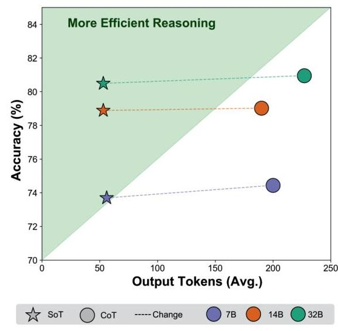
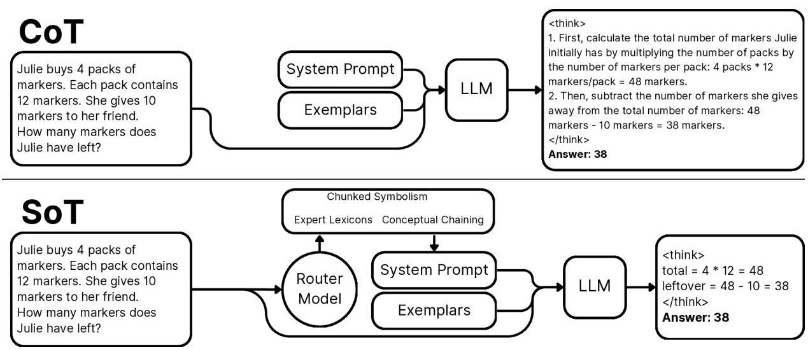

# Sketch-of-Thought: Efficient LLM Reasoning with Adaptive Cognitive-Inspired Sketching

*Source: [arXiv:2503.05179](https://arxiv.org/abs/2503.05179)*

*[Submitted on Fri, 7 Mar 2025 06:57:17 UTC]*

# Sketch-of-Thought: Efficient LLM Reasoning with Adaptive Cognitive-Inspired Sketching 

Simon A. Aytes ${ }^{1}$ Jinheon Baek ${ }^{1}$ Sung Ju Hwang ${ }^{1,2}$<br>KAIST ${ }^{1}$ DeepAuto.ai ${ }^{2}$<br>\{saytes, jinheon.baek, sungju.hwang\}@kaist.ac.kr


#### Abstract

Recent advances in large language models have demonstrated remarkable reasoning capabilities through Chain of Thought (CoT) prompting, but often at the cost of excessive verbosity in their intermediate outputs, which increases computational overhead. We introduce Sketch-of-Thought (SoT), a novel prompting framework that combines cognitive-inspired reasoning paradigms with linguistic constraints to minimize token usage while preserving reasoning accuracy. SoT is designed as a flexible framework that can incorporate any custom reasoning paradigms based on cognitive science, and we instantiate it with three such paradigms-Conceptual Chaining, Chunked Symbolism, and Expert Lexicons-each tailored to different reasoning tasks and selected dynamically via a lightweight routing model. Through comprehensive evaluation across 15 reasoning datasets with multiple languages and multimodal scenarios, we demonstrate that SoT achieves token reductions of $76 \%$ with negligible accuracy impact. In certain domains like mathematical and multi-hop reasoning, it even improves accuracy while using significantly fewer tokens. Our code is publicly available ${ }^{1}$.


## 1 Introduction

Large language models (LLMs) have emerged as powerful tools capable of performing complex reasoning tasks across diverse domains (Zhao et al., 2024; Bubeck et al., 2023). Despite not being explicitly trained for reasoning, these models demonstrate emergent capabilities when prompted effectively to decompose complex problems into intermediate steps. Chain of Thought (CoT) prompting (Wei et al., 2023) represents one of the most significant breakthroughs in eliciting these reasoning abilities, guiding models to articulate their thinking process step-by-step before producing a final answer. This technique has substantially improved

[^0]

Figure 1: A comparison of accuracy and token usage in the Chain-of-Thought (CoT) (Wei et al., 2023) and the proposed Sketch-of-Thought (SoT). Average of tests across 15 datasets using the family of Qwen-2.5 models. Shaded region represents more efficient reasoning.
performance on tasks from mathematical problemsolving to logical reasoning (Sprague et al., 2024).

While CoT effectively enhances reasoning accuracy, it typically generates verbose intermediate steps that substantially increase token usage and computational costs. This verbosity presents significant challenges for real-world applications, particularly in resource-constrained environments where inference expenses and latency are critical concerns (Nayab et al., 2025; Arora and Zanette, 2025). Subsequent research has expanded upon CoT with more sophisticated approaches: Self-Consistency (Wang et al., 2023b) generates multiple reasoning paths and selects the most frequent answer, Tree of Thoughts (Yao et al., 2023) explores branching decision trees of possible reasoning routes, and Graph of Thoughts (Besta et al., 2024) structures reasoning as interconnected nodes allowing for more complex deduction patterns. While these methods fur-


[^0]:    ${ }^{1}$ https://www.github.com/SimonAytes/SoT

ther enhance reasoning capabilities through diverse exploration strategies, they generally amplify rather than reduce the underlying token inefficiency.

To address this, we present Sketch-of-Thought (SoT), a prompting framework that fundamentally reimagines how language models express their reasoning processes. Our approach draws inspiration from cognitive science, particularly the concept of "sketches" as articulated in Goel (1995), which characterizes them as symbolic representations that serve as efficient intermediaries in cognitive processes. Consider how an expert physicist might work through a complex problem: rather than writing full sentences explaining each step, they might jot down key variables, scribble abbreviated equations, and use domain-specific notation that would be nearly incomprehensible to a non-expert-yet these concise marks capture the essence of their reasoning process. Similarly, when we take notes during a lecture or meeting, we naturally abbreviate, use arrows to show connections, and omit obvious context, creating "sketches" of ideas rather than verbose descriptions. As such, these sketches appear in countless domains, and in each case, the sketches serve as efficient thinking tools that omit verbosity while preserving essential reasoning steps.

Motivated by this, we develop three distinct paradigms grounded in cognitive science principles that mirror how humans streamline their reasoning processes. These paradigms leverage specific cognitive mechanisms: Conceptual Chaining draws on associative memory networks to connect ideas with minimal verbalization, Chunked Symbolism applies working memory chunking theory to organize mathematical reasoning into concise symbolic representations, and Expert Lexicons emulates the efficient domain-specific shorthand used by specialists. Each paradigm addresses different reasoning demands while significantly reducing token usage compared to traditional verbose reasoning. To implement these paradigms, we instantiate LLMs through carefully engineered prompts and exemplars, allowing our approach to work with any models without requiring specific training. A key challenge in deploying these paradigms effectively is determining which approach best suits each particular reasoning task. To address this, we develop a lightweight router model that dynamically selects the optimal reasoning paradigm based on query characteristics, ensuring that the most efficient reasoning strategy is applied to each problem.

Our comprehensive evaluation across 15 rea-
soning datasets (spanning mathematical, commonsense, logical, multi-hop, scientific, and medical tasks and domains) shows that the proposed SoT not only preserves accuracy in most domains but occasionally improves it, particularly for mathematical and multi-hop reasoning. We further demonstrate SoT's versatility through multilingual and multimodal experiments, confirming its effectiveness across different languages and input modalities. These results suggest that concise, structured reasoning can be as effective as (and sometimes superior to) the verbose explanations typically generated by traditional prompting approaches.

We summarize our contributions as follows:

- We introduce Sketch-of-Thought (SoT), a novel prompting framework with three specialized reasoning paradigms grounded in cognitive science principles.
- We develop a lightweight auxiliary model that dynamically chooses the optimal reasoning paradigm for each query.
- Evaluations across diverse reasoning datasets (including multilingual and multimodal scenarios) show that SoT reduces token usage by up to $76 \%$ with minimal accuracy impact, and even improves performance in some tasks.


## 2 Method

This section details the technical implementation of Sketch-of-Thought (SoT), our framework for efficient reasoning in large language models.

### 2.1 Preliminary

We start by providing background on large language models and their application to reasoning.

Large Language Models Large Language Models (LLMs) are models trained on vast text corpora to predict the next token in a sequence. Formally, an LLM with parameters $\theta$ takes an input sequence of tokens $x$ and generates an output sequence $y$, represented as $y=\operatorname{LLM}_{\theta}(x)$. These models have shown remarkable performance across disparate domains;, however, their computational efficiency remains a significant concern as inference costs scale with the number of tokens processed and generated as well as their parameter sizes.



Figure 2: Comparison of Chain-of-Thought (CoT) and Sketch-of-Thought (SoT) workflows. While CoT generates verbose reasoning steps directly from prompts, SoT employs a router model to select the optimal reasoning paradigm, producing significantly more compact intermediate steps while maintaining accuracy.

## Instantiating LLMs for Reasoning with Prompts

Recent LLMs demonstrate emergent reasoning ca-pabilities-the ability to solve complex problems through step-by-step logical deduction despite not being explicitly trained for such tasks. The primary method for eliciting reasoning from LLMs is through prompting, where carefully constructed natural language instructions guide the model's generation process (Wei et al., 2023). Let $P$ represent a prompt template that includes task description, instructions, and exemplars. The reasoning process can then be formalized as $r=$ $\operatorname{LLM}_{\theta}(P(q))$, where $q$ is the query and $r$ is the reasoning path. As one approach to elicit the reasoning ability of LLMs, Chain-of-Thought (CoT) prompting instructs models to decompose problems into intermediate steps before producing the final answer. Formally, this can be expressed as $\left[s_{1}, s_{2}, \ldots, s_{n}, a\right]=\operatorname{LLM}_{\theta}\left(P_{\mathrm{CoT}}(q)\right)$, where $s_{i}$ represents the $i$-th reasoning step and $a$ is the final answer. Its example is shown in the box below.

## Transitions: CoT

```
Q: If a train travels 60 miles per hour for 3 hours,
how far does it go?
a: <think> !. I understand we need to find the total
distance traveled by: A train moving at 60 miles per
hour for a duration of 3 hours.
2. To calculate the distance, I'll use the formula:
Distance = Speed * Time
Distance = 60 miles/hour * 3 hours
3. Now I'll perform the calculation:
Distance = 60 * 3 = 180 miles
4. Verification:
This makes sense because the train moves 60 miles
each hour. After 3 hours, it will have covered 3
times that distance. </think>
Answer: 180 miles
```

While this approach improves reasoning accuracy, it tends to generate verbose explanations that significantly increase token usage and computational costs, especially when LLMs are large.

### 2.2 Sketch-of-Thought (SoT)

Sketch-of-Thought (SoT) addresses a key limitation in traditional reasoning approaches: the verbosity of intermediate reasoning steps $s_{1}, s_{2}, \ldots, s_{n}$ that significantly increases token usage and computational costs. It is worth noting that, unlike prior work on efficient prompting that primarily focuses on reducing the input prompt size $P(q)$ (Jiang et al., 2023; Huang et al., 2024), our approach targets the reasoning process itself by redesigning how language models articulate their intermediate steps.

Formally, we develop specialized prompt templates $P_{\text {SoT }}$ that guide models to generate concise reasoning: $\left[\hat{s}_{1}, \hat{s}_{2}, \ldots, \hat{s}_{m}, a\right]=\operatorname{LLM}_{\theta}\left(P_{\mathrm{SoT}}(q)\right)$, where $\hat{s}_{i}$ represents a sketched reasoning step that conveys the same logical information as $s_{i}$ but with substantially fewer tokens, i.e., $|\hat{s}|<|s|$ where $|\cdot|$ measures the number of tokens. These templates combine cognitive-inspired paradigms with lcrguistic constraints that dictate structure and verbosity level of responses.

We then operationalize our approach with cognitive sketching by translating human cognitive shortcuts into systematic prompting strategies. SoT instructs language models to express reasoning through high-efficiency patterns similar to how experts use abbreviated notations in their domains. It is worth noting that, while the operation of SoT is

flexible enough to incorporate any custom reasoning paradigms (based on cognitive science), as an initial foray, we include three reasoning paradigms, each tailored to specific types of reasoning tasks. Also, this implementation requires no model finetuning-only carefully designed prompt templates inspired by cognitive science principles. We now turn to concretizing these paradigms alongside examples that illustrate how SoT distills essential reasoning steps into more efficient representations.

Conceptual Chaining. Rooted in cognitive science principles of how humans connect and retrieve related information, this paradigm creates concise logical sequences between key concepts. It draws from episodic buffer integration (Baddeley, 2000), the cognitive mechanism that temporarily holds and links information from different sources, and associative memory networks (Anderson, 1983), which describe how activating one concept automatically triggers related concepts in our minds (like how thinking of "rain" might immediately evoke "umbrella"). Conceptual Chaining extracts essential terms and presents reasoning as direct step-by-step pathways with minimal text, shown below.

## Conceptual Chaining

Q: What is the name of the currency used in Seoul?
A: <think> \#Seoul $=$ \#South Korea $=$ Won </think> Answer: Korean Won

Conceptual Chaining is particularly effective for commonsense reasoning, multi-hop inference, and fact-based recall tasks, where establishing relationships between ideas is critical.

Chunked Symbolism. Based on working memory chunking theory (Miller, 1956), this paradigm organizes numerical and symbolic reasoning into compact, structured steps. This seminal cognitive science research showed that humans can only hold about $7 \pm 2$ (i.e., 5 to 9 ) distinct items in working memory at once, but we overcome this limitation by "chunking" related information into meaningful units-like remembering phone numbers as area code, prefix, and line number instead of 10 separate digits. Chunked Symbolism applies this principle by condensing mathematical reasoning into dense symbolic representations that pack more information into fewer tokens. It systematically extracts variables, equations, and operations while eliminating verbose explanations, transforming natural language into a structured mathematical shorthand that preserves logical flow, as follows.

## Chunked Symbolism

Q: A car accelerates at $2.5 \mathrm{~m} / \mathrm{s}^{-1} 2$ for 10 seconds. If its initial velocity was $15 \mathrm{~m} / \mathrm{s}$, what is its final velocity?
A: <think> a $=2.5 \mathrm{~m} / \mathrm{s}^{-1} 2, \mathrm{t}=10 \mathrm{~s}, \mathrm{vi}=15 \mathrm{~m} / \mathrm{s} \mathrm{vf}=$ $15=(2.5+10), \mathrm{vf}=40 \mathrm{~m} / \mathrm{s} \mathrm{</think>}$ Answer: $40 \mathrm{~m} / \mathrm{s}$

This approach excels in mathematical problems, symbolic reasoning, and technical calculations where symbolic notation naturally compresses complex concepts.

Expert Lexicons. Inspired by expert schema research (Chi et al., 1981), this paradigm leverages domain-specific shorthand and specialized notation to condense reasoning. This research demonstrated that experts in any field organize knowledge differently than novices-they develop mental frameworks (schemas) that allow them to quickly recognize patterns and use specialized terminology to communicate efficiently with peers. For example, a physician can convey complex medical conditions with a few acronyms that would require paragraphs of explanation for non-specialists. Expert Lexicons mimics this cognitive efficiency by employing domain-specific abbreviations, notation, and symbols that pack multiple concepts into single tokens. The example below demonstrates how domain-specialized reasoning can be compressed into concise notation while preserving the critical logical connections.

## Expert Lexicons

Q: A patient with STEMI is given MDNA therapy. They are allergic to aspirin. Are they at risk with this treatment?
A: <think> STEMI $=$ ST-Elevation MI, MDNA $=$ Morphine, 02, Nitrates, Aspirin, so Aspirin $\odot$ MDNA </think> Answer: Yes

This method is particularly suited for technical disciplines, specialized reasoning tasks, and scenarios where domain expertise enables significant information compression.

### 2.3 Adaptive Paradigm Selection

Among the three reasoning paradigms discussed, effective use of SoT requires applying the most appropriate paradigm to each query. To achieve this, we propose a lightweight router model that analyzes question characteristics based on linguistic indicators such as mathematical symbols, multihop dependencies, or domain-specific terminology, and selects the most suitable approach based on these structural and semantic features.

Specifically, given the query $q$, our router model is denoted as follows: $P_{\text {SoT }}=\operatorname{ROUTER}(q)$, where

$P_{\mathrm{SoT}}$ is one among three reasoning paradigms (to instantiate LLMs for their efficient reasoning) and ROUTER is a smaller language model (Sanh et al., 2020). Also, this model is trained with samples (from reasoning tasks) that are paired with the most appropriate paradigm. This design ensures minimal computational overhead in inference while maintaining flexibility across input types. Specific implementation details are provided in Section 3.3.

## 3 Experiment Setup

### 3.1 Datasets

To ensure comprehensive evaluation of our method, we evaluate Sketch-of-Thought (SoT) on 15 datasets grouped into six reasoning categories. We categorize each dataset according to the framework established by Sun et al. (2024). The datasets, grouped by category, are as follows: Mathematical Reasoning: GSM8K (Cobbe et al., 2021), SVAMP (Patel et al., 2021), AQUA-RAT (Ling et al., 2017), DROP (Dua et al., 2019); Commonsense Reasoning: CommonsenseQA (Talmor et al., 2019), OpenbookQA (Mihaylov et al., 2018), StrategyQA (Geva et al., 2021); Logical Reasoning: LogiQA (Liu et al., 2020), Reclor (Yu et al., 2020); MultiHop Reasoning: HotPotQA (Yang et al., 2018), MuSiQue-Ans (Trivedi et al., 2022); Scientific/Causal Reasoning: QASC (Khot et al., 2020), Worldtree (Jansen et al., 2018); Other (Medical Reasoning): PubMedQA (Jin et al., 2019), MedQA (Jin et al., 2020).

Additionally, we include two datasets to demonstrate the extensibility of our method to both multilingual and multi-modal scenarios. For our multilingual experiment, we use MMLU and its translated complement MMMLU (Hendrycks et al., 2021). For our multi-modal experiment, we use the multi-modal split of ScienceQA (Lu et al., 2022).

### 3.2 Model Configurations

For our primary experiments and multi-lingual evaluations, we utilize the Qwen-2.5 family of models in 7B, 14B, and 32B parameter sizes (Yang et al., 2024; Team, 2024). For our multimodal experiment, we employ the Qwen-2.5-VL 7B model (Team, 2025), as the standard variants do not support image inputs. To optimize inference efficiency, we implement FlashAttention2 (Dao, 2023) across all experimental configurations.

We use a temperature of 0.5 for all experiments, which provides a balance between deter-
ministic reasoning and sufficient diversity for SelfConsistency sampling.

### 3.3 Router Model Training

We constructed a training corpus by sampling questions from the training splits of our experimental datasets (see §3.1), collecting approximately 14,200 samples across reasoning tasks. Each sample was labeled with one of the three paradigms using GPT-4o (OpenAI, 2024) with a classificationspecific prompt that included manually labeled examples and detailed the characteristics of each paradigm based on predefined heuristics.

For the classification model, we selected DistilBERT (Sanh et al., 2020) due to its favorable balance of efficiency and performance. As a lightweight version of BERT, it offers sufficient representational capacity for this classification task while introducing minimal computational overhead in the inference pipeline. This efficiency is particularly important since paradigm selection occurs as a preprocessing step for every query. The model processes only the question text without associated contextual information, utilizing a context token in cases where contextual data would normally be present. This design choice ensures extensibility to multimodal inputs where the context might be an image or other non-textual element. The model was trained with a batch size of 64 for 5 epochs using cross-entropy loss and a learning rate of 2e-5.

### 3.4 Primary Experiments

Our primary experiments evaluate the effectiveness and efficiency of three problem-solving methods across 15 text-only English datasets: Sketch of Thought (SoT), Chain-of-thought (CoT) (Wei et al., 2023), and Self-Consistency (Wang et al., 2023b). For each dataset, we select 150 samples from their test splits.

We employ a standardized evaluation protocol across all experiments. For multiple-choice, yesno, and numerical questions, answer accuracy is determined by comparing the model's extracted answer with the ground truth. For open-ended questions, we use GPT-4o (OpenAI, 2024) to evaluate against the ground truth, finding this method effectively handles edge-cases that would be inaccurately scored by traditional BERTScore (Zhang et al., 2020). Token usage is measured by counting output tokens generated during reasoning, excluding the final answer statement.

Similar to the original implementation of CoT,

| Reasoning Task |  |  |  |  |  |  |  |  |  |  |  |  |  |  |  |
| :--: | :--: | :--: | :--: | :--: | :--: | :--: | :--: | :--: | :--: | :--: | :--: | :--: | :--: | :--: | :--: |
| Method | Mathematical |  | Commonsome |  | Logical |  | Multi-Hop |  | Scientific |  | Specialized |  | Overall |  |  |
|  | \% | Tokens | \% | Tokens | \% | Tokens | \% | Tokens | \% | Tokens | \% | Tokens | \% $\uparrow$ | Tokens $\downarrow$ | Red. $\uparrow$ | $\Delta$ Acc $\uparrow$ |
| Qwen-2.5-32B |  |  |  |  |  |  |  |  |  |  |  |  |  |  |  |
| CoT | 84.17 | 221 | 90.33 | 186 | 71.23 | 297 | 79.44 | 154 | 92.89 | 212 | 67.66 | 291 | 80.95 | 227 | - | - |
| SoT | 86.94 | 88 | 90.66 | 30 | 71.00 | 65 | 81.89 | 43 | 91.33 | 31 | 61.11 | 62 | 80.49 | 53 | 76.22 | $-0.46$ |
| SC+CoT | 84.33 | 665 | 91.00 | 560 | 71.67 | 892 | 81.00 | 464 | 93.34 | 638 | 67.33 | 875 | 81.44 | 682 | - | - |
| SC+SoT | 87.50 | 265 | 90.66 | 92 | 71.33 | 197 | 82.67 | 129 | 92.00 | 94 | 61.66 | 187 | 80.97 | 161 | 76.22 | $-0.47$ |
| Qwen-2.5-14B |  |  |  |  |  |  |  |  |  |  |  |  |  |  |  |  |
| CoT | 83.00 | 189 | 90.44 | 155 | 67.00 | 248 | 77.67 | 148 | 90.89 | 164 | 65.11 | 234 | 79.02 | 190 | - | - |
| SoT | 82.72 | 78 | 89.78 | 35 | 67.44 | 63 | 79.89 | 45 | 90.89 | 37 | 62.56 | 62 | 78.88 | 53 | 71.80 | $-0.14$ |
| SC+CoT | 83.17 | 569 | 92.33 | 467 | 69.33 | 744 | 76.33 | 446 | 91.00 | 493 | 66.33 | 703 | 79.75 | 570 | - | - |
| SC+SoT | 83.67 | 234 | 90.00 | 106 | 68.66 | 190 | 80.00 | 135 | 91.33 | 111 | 62.00 | 187 | 79.28 | 161 | 71.80 | $-0.47$ |
| Qwen-2.5-7B |  |  |  |  |  |  |  |  |  |  |  |  |  |  |  |  |
| CoT | 77.41 | 180 | 85.78 | 172 | 63.22 | 279 | 76.78 | 137 | 86.44 | 183 | 57.00 | 246 | 74.44 | 200 | - | - |
| SoT | 77.05 | 73 | 85.11 | 27 | 59.78 | 61 | 77.22 | 44 | 85.00 | 27 | 58.00 | 105 | 73.69 | 56 | 71.90 | $-0.74$ |
| SC+CoT | 79.33 | 542 | 86.44 | 516 | 66.11 | 837 | 78.33 | 412 | 87.00 | 550 | 58.34 | 739 | 75.93 | 600 | - | - |
| SC+SoT | 78.83 | 219 | 85.66 | 81 | 60.34 | 184 | 77.33 | 134 | 85.00 | 82 | 59.00 | 317 | 74.36 | 169 | 71.90 | $-1.57$ |

Table 1: Primary Experimental Results for SoT. Results are shown for Sketch-of-Thought (SoT), Chain-ofThought (CoT), and Self-Consistency (SC). We separate results by reasoning type and report them alongside overall results. For each reasoning task we report the average of all associated datasets. "\%" denotes accuracy and "Tokens" denotes the number of tokens. In the Overall section, we report two additional metrics: the token reduction percentage (shown as "Red.") and the change in accuracy between SoT and the baseline (shown as " $\Delta$ Acc").

| Lang. | Method | Tokens | \% | Red. | Acc. $\Delta$ |
| :--: | :--: | :--: | :--: | :--: | :--: |
| Korean | CoT | 315 | 77.27 | - | - |
|  | SoT | 45 | 76.26 | 85.71 | $-1.01$ |
| Italian | CoT | 336 | 81.50 | - | - |
|  | SoT | 50 | 79.50 | 85.12 | $-2.00$ |
| German | CoT | 309 | 83.42 | - | - |
|  | SoT | 46 | 84.92 | 85.11 | 1.50 |

Table 2: Multilingual Results. Performance comparison of CoT and SoT across different languages.
we employ a few-shot approach with exemplars to demonstrate the desired reasoning format. For both SoT and CoT, we generated exemplars by creating diverse questions, prompting Qwen-32B with the appropriate system prompt, evaluating output faithfulness, and selecting high-quality responses. These exemplars are listed in Appendix B.

Self-Consistency is applied to both CoT and SoT using their respective exemplars. The appropriate paradigm for each question is selected via our pre-trained DistilBERT model (see §2.3). For Self-Consistency experiments, we generate three reasoning paths per question and determine the final answer through majority voting (Wang et al., 2023b).

### 3.5 Multilingual Experiment

To demonstrate SoT's effectiveness in reducing reasoning tokens across languages, we conduct experiments in Korean, German, and Italian-languages
compatible with our selected models (Yang et al., 2024) and included in MMMLU, a professionally translated version of the MMLU dataset (Hendrycks et al., 2021). Previous research has shown that English generally outperforms the native query language in zero-shot CoT (Payoungkhamdee et al., 2024); however, our experiment aims to evaluate token reduction capabilities rather than focusing solely on accuracy.

For paradigm selection, we match each nonEnglish question with its English counterpart and use our DistilBERT model on the English version, applying the selected paradigm consistently across all language variants. Both paradigm-specific system prompts and exemplars were machinetranslated to the target languages using GPT-4o (OpenAI, 2024).

Since mathematical tasks tend to produce less language-dense outputs with SoT, we focus our evaluation on the management and astronomy domains from MMLU/MMMLU, which typically elicit more text-based responses. For each language-domain combination, we select 100 samples from the test splits.

### 3.6 Multimodal Experiment

Problem solving in multimodal tasks is achieved similarly to unimodal tasks: through text-based reasoning. This experiment demonstrates that Sketch-of-Thought (SoT) extends to multimodal scenarios. We evaluate Qwen2.5-7B-VL (Team, 2025) on the

| Method | Tokens | $\%$ | Red | $\operatorname{Acc} \Delta$ |
| :--: | :--: | :--: | :--: | :--: |
| CoT | 151 | 85.91 | - | - |
| SoT | 28 | 82.47 | $\mathbf{8 1 . 4 6}$ | $\mathbf{- 3 . 4 4}$ |

Table 3: Multimodal Results. Performance comparison of CoT and SoT for multimodal reasoning tasks.
multimodal split of ScienceQA (Lu et al., 2022) to demonstrate this extensibility.

For paradigm selection, we use the same DistilBERT model as in the primary experiment. We consider any included images as "context" for the question and therefore omit them from the paradigm selection process in favor of a context indicator, as done in the unimodal setting (§2.3).

## 4 Results and Discussion

### 4.1 Overall Performance

As shown in Table 1, Sketch-of-Thought (SoT) achieves substantial token reduction while maintaining comparable accuracy to Chain-of-Thought (CoT) across all model sizes. Specifically, SoT reduces token usage by $76.22 \%, 71.80 \%$, and $71.90 \%$ for the 32B, 14B, and 7B models respectively, with minimal accuracy differences of $-0.46 \%,-0.14 \%$, and $-0.74 \%$. This dramatic efficiency gain with negligible performance penalty demonstrates that extensive verbalization is not necessary for effective reasoning in language models.

The consistency of these results across model sizes is particularly noteworthy, as it suggests that the benefits of SoT are not dependent on model scale. Rather than requiring larger models to maintain accuracy with reduced tokens, we find that all model sizes benefit similarly from the SoT approach. This has significant implications for practical applications where computational resources are limited.

### 4.2 Task-Specific Performance

Mathematical Reasoning. In mathematical tasks, SoT achieves token reductions of $60.18 \%$, $58.73 \%$, and $59.44 \%$ across the $32 \mathrm{~B}, 14 \mathrm{~B}$, and 7B models while maintaining or even improving accuracy ( $+2.77 \%,-0.28 \%$, and $-0.36 \%$ ). The Chunked Symbolism paradigm proves especially effective here, leveraging symbolic notation to express complex calculations with minimal text. Notably, the 32B model's improved accuracy suggests that structured constraints may actually enhance mathematical reasoning by focusing the model on essential computational steps.

Commonsense and Scientific Reasoning. These categories demonstrate the most dramatic token reductions (77-85\%) with minimal accuracy impact. For commonsense reasoning, the 32B model maintains a slight accuracy advantage ( $+0.33 \%$ ) despite using $83.87 \%$ fewer tokens. Similarly, scientific reasoning shows consistent performance with dramatically reduced verbosity. These results indicate that domains with well-established conceptual frameworks are particularly amenable to compression, as models can leverage concise terminology and structured representations to maintain reasoning quality.

Logical and Multi-hop Reasoning. Logical reasoning tasks show substantial token reduction (74$78 \%$ ) with variable accuracy impacts across model sizes. Most interestingly, multi-hop reasoning demonstrates consistent accuracy improvements across all models ( $+2.45 \%,+2.22 \%$, and $+0.44 \%$ ) despite token reductions of $67-72 \%$. This counterintuitive finding suggests that verbosity constraints may enhance focus on critical inferential links while reducing distracting elaborations, leading to more precise multi-hop reasoning.

Specialized Reasoning. In the specialized medical domain, we observe significant token reductions (57-78\%) with more variable accuracy trade-offs across model sizes ( $-6.55 \%,-2.55 \%$, and $+1.00 \%$ ). The larger accuracy variance suggests that highly technical domains may require more careful calibration of verbosity constraints, particularly for larger models. Nevertheless, even in this challenging category, the efficiency gains remain substantial and the performance impact acceptable for many applications.

### 4.3 Cross-Modal and Cross-Linguistic Generalization

Our experiments demonstrate that SoT's benefits extend beyond standard English-language textual reasoning to both multilingual and multimodal scenarios.

As shown in Table 3, SoT maintains its efficiency advantages in multimodal reasoning tasks, achieving an $81.46 \%$ token reduction with a modest $3.44 \%$ accuracy decrease. This indicates that SoT can dramatically reduce verbosity while preserving most performance even when reasoning requires visual and textual integration.

Similarly, the multilingual results in Table 2 demonstrate consistent token reductions across Korean (85.71\%), Italian (85.12%), and German ( $85.11 \%$ ) with minimal accuracy impacts ( $-1.01 \%$, $-2.00 \%$, and $+1.50 \%$ ). These findings indicate that SoT captures fundamental aspects of reasoning that transcend specific linguistic expressions.

### 4.4 Self-Consistency Improvements

The application of Self-Consistency (SC) to both CoT and SoT provides additional insights into the efficiency-accuracy trade-off. While SC improves accuracy for both approaches, it dramatically amplifies the token efficiency advantage of SoT. The SC+SoT combination maintains comparable accuracy to SC+CoT while using $76.22 \%, 71.80 \%$, and $71.90 \%$ fewer tokens for the $32 \mathrm{~B}, 14 \mathrm{~B}$, and 7 B models respectively.

This finding is particularly significant as it demonstrates that SoT can be effectively combined with other reasoning enhancement techniques. The multiplicative token savings when using SC (which requires multiple reasoning paths) makes SoT especially valuable in ensemble-based approaches where computational efficiency is critical.

### 4.5 Practical Implications

The consistent and substantial token reductions demonstrated by SoT translate directly to computational savings, potentially reducing inference costs by $70-80 \%$ for reasoning-intensive applications. This efficiency gain could significantly improve the practicality of advanced reasoning capabilities in resource-constrained environments such as mobile devices, edge computing, and regions with limited computational infrastructure.

Moreover, the minimal accuracy trade-offs across diverse reasoning tasks suggest that SoT represents a genuine advancement in reasoning efficiency rather than merely a performance compromise. By structuring and constraining the reasoning process according to cognitive principles, SoT enables models to focus on essential logical connections while eliminating redundant elaboration, resulting in more computationally efficient reasoning without sacrificing effectiveness.

## 5 Related Work

### 5.1 Reasoning Enhancement in LLMs

Large language models have demonstrated remarkable reasoning capabilities, driven largely
by prompting techniques that guide their step-bystep thinking processes. Chain of Thought (CoT) prompting (Wei et al., 2023) pioneered this approach by instructing models to break down complex problems into intermediate reasoning steps before providing final answers. This foundational work inspired numerous extensions: SelfConsistency (Wang et al., 2023b) generates multiple reasoning paths and selects the most consistent answer, Tree of Thoughts (Yao et al., 2023) explores branching reasoning pathways to solve more complex problems, and Graph of Thoughts (Besta et al., 2024) structures reasoning as interconnected nodes in a graph. Recent innovations have explored orthogonal approaches to reasoning enhancement, such as Coconut (Hao et al., 2024), which moves reasoning into a continuous latent space rather than using discrete tokens. These latent space methods address fundamentally different aspects of reasoning than our token-efficiency focus, as they require architectural modifications rather than prompting strategies. While these various approaches have significantly improved reasoning accuracy across challenging tasks, they generally achieve these gains by generating increasingly complex reasoning processes-expanding rather than reducing the computational overhead of inference.

### 5.2 Efficient Prompting Techniques

Researchers have explored various approaches to make prompting more computationally efficient without sacrificing performance. Input-side optimizations include LLMLingua (Jiang et al., 2023), which compresses prompts to accelerate inference, and automated prompt optimization techniques that systematically refine prompts for better performance (Pryzant et al., 2023). Huang et al. (2024) introduced CoT-Influx, which employs a coarse-to-fine pruner to maximize the input of effective and concise CoT examples, significantly improving mathematical reasoning performance without model fine-tuning. Other works focus on more efficient few-shot learning, with Fu et al. (2023) demonstrating how smaller language models can be specialized for multi-step reasoning tasks. On the output side, Arefeen et al. (2023) introduced techniques for more compact context representation, while Yue et al. (2024) proposed using a mixture of thoughts representations in an LLM cascade to balance cost efficiency and reasoning performance. Most recently, Arora and Zanette (2025) introduced a reinforcement learning approach to

train reasoning models that dynamically allocate inference-time compute based on task complexity. However, these approaches typically focus on either input compression or reasoning structure optimization, rather than directly addressing the verbosity of model outputs during the reasoning process itself.

### 5.3 Token-Efficient Reasoning Approaches

A growing body of work directly targets the reduction of output tokens during language model reasoning. Concise Chain-of-Thought (Renze and Guven, 2024) pioneered more compact reasoning chains by simply instructing models to limit their response length, while SCOTT (Wang et al., 2023a) explored a two-stage approach that first generates verbose reasoning and then distills it into more efficient forms. Building on these foundations, several very recent works have made significant advances: Nayab et al. (2025) introduced Constrained-CoT (CCoT), which encourages conciseness through explicit prompting with examples of compact reasoning while proposing metrics to evaluate "correct conciseness" and information flow. Our work addresses these limitations by developing distinct reasoning paradigms directly derived from established cognitive science principles (episodic buffer integration, working memory chunking, and expert schema theory), each tailored to specific task types for more effective token-efficient reasoning.

## 6 Limitations \& Future Work

While Sketch-of-Thought demonstrates substantial benefits for reasoning efficiency, we acknowledge several limitations in our current approach. Although we dynamically select reasoning paradigms, we use static exemplars within each paradigm rather than adapting them for specific task types (e.g., arithmetic vs. physics calculations). Our evaluation is also limited to models from the Qwen-2.5 family, which provides consistency for comparison but leaves questions about performance across different architectures. Additionally, the larger accuracy declines in specialized domains like medical reasoning ( $-6.55 \%$ for the 32B model) suggest that verbosity constraints may require domain-specific calibration for critical domains.

Future work could address these limitations through several promising directions. Implementing retrieval-augmented generation (RAG) could enable dynamic selection of not only reasoning
paradigms but also task-specific exemplars, while development of additional specialized paradigms could address cognitive operations not optimally served by current approaches. Finally, investigating a reasoning model trained specifically on SoT could yield significant advances, potentially teaching models to internalize the principles of concise reasoning while eliminating accuracy penalties observed in specialized domains. More sophisticated paradigm selection models could incorporate additional signals beyond question text to improve paradigm matching.

## 7 Conclusion

In this paper, we introduced Sketch-of-Thought (SoT), a novel prompting framework that dramatically reduces token usage in language model reasoning while maintaining comparable accuracy to traditional Chain-of-Thought approaches. By combining cognitive-inspired reasoning paradigms with linguistic constraints, SoT achieves token reductions of 71-76\% across model sizes with minimal accuracy trade-offs ( $-0.14 \%$ to $-0.74 \%$ ). These efficiency gains extend across diverse reasoning tasks, multiple languages, and even multimodal scenarios, demonstrating the broad applicability of our approach. The success of SoT challenges conventional assumptions about verbosity requirements in language model reasoning and offers a practical solution for computationally efficient AI reasoning. As large language models continue to play increasingly important roles in resource-constrained environments, approaches like SoT that optimize computational efficiency without sacrificing reasoning capabilities will be essential for democratizing access to advanced AI reasoning technologies.

## References

John R. Anderson. 1983. A spreading activation theory of memory. Journal of Verbal Learning and Verbal Behavior, 22(3):261-295.

Md Adnan Arefeen, Biplob Debnath, and Srimat Chakradhar. 2023. Leancontext: Cost-efficient domain-specific question answering using llms. Preprint, arXiv:2309.00841.

Daman Arora and Andrea Zanette. 2025. Training language models to reason efficiently. Preprint, arXiv:2502.04463.
A. Baddeley. 2000. The episodic buffer: a new component of working memory? Trends in Cognitive Sciences, 4(11):417-423.

Maciej Besta, Nils Blach, Ales Kubicek, Robert Gerstenberger, Michal Podstawski, Lukas Gianinazzi, Joanna Gajda, Tomasz Lehmann, Hubert Niewiadomski, Piotr Nyczyk, and Torsten Hoefler. 2024. Graph of thoughts: Solving elaborate problems with large language models. Proceedings of the AAAI Conference on Artificial Intelligence, 38(16):17682-17690.

Sébastien Bubeck, Varun Chandrasekaran, Ronen Eldan, Johannes Gehrke, Eric Horvitz, Ece Kamar, Peter Lee, Yin Tat Lee, Yuanzhi Li, Scott Lundberg, Harsha Nori, Hamid Palangi, Marco Tulio Ribeiro, and Yi Zhang. 2023. Sparks of artificial general intelligence: Early experiments with gpt-4. Preprint, arXiv:2303.12712.

Michelene T. H. Chi, Paul J. Feltovich, and Robert Glaser. 1981. Categorization and Representation of Physics Problems by Experts and Novices. Cognitive Science, 5(2):121-152.

Karl Cobbe, Vineet Kosaraju, Mohammad Bavarian, Mark Chen, Heewoo Jun, Lukasz Kaiser, Matthias Plappert, Jerry Tworek, Jacob Hilton, Reiichiro Nakano, Christopher Hesse, and John Schulman. 2021. Training Verifiers to Solve Math Word Problems. arXiv preprint. ArXiv:2110.14168 [cs].

Tri Dao. 2023. Flashattention-2: Faster attention with better parallelism and work partitioning. Preprint, arXiv:2307.08691.

Dheeru Dua, Yizhong Wang, Pradeep Dasigi, Gabriel Stanovsky, Sameer Singh, and Matt Gardner. 2019. DROP: A Reading Comprehension Benchmark Requiring Discrete Reasoning Over Paragraphs. arXiv preprint. ArXiv:1903.00161 [cs].

Yao Fu, Hao Peng, Litu Ou, Ashish Sabharwal, and Tushar Khot. 2023. Specializing smaller language models towards multi-step reasoning. Preprint, arXiv:2301.12726.

Mor Geva, Daniel Khashabi, Elad Segal, Tushar Khot, Dan Roth, and Jonathan Berant. 2021. Did Aristotle Use a Laptop? A Question Answering Benchmark with Implicit Reasoning Strategies. arXiv preprint. ArXiv:2101.02235 [cs].

Vinod Goel. 1995. Sketches of Thought. MIT Press.
Shibo Hao, Sainbayar Sukhbaatar, DiJia Su, Xian Li, Zhiting Hu, Jason Weston, and Yuandong Tian. 2024. Training large language models to reason in a continuous latent space. Preprint, arXiv:2412.06769.

Dan Hendrycks, Collin Burns, Steven Basart, Andy Zou, Mantas Mazeika, Dawn Song, and Jacob Steinhardt. 2021. Measuring Massive Multitask Language Understanding. arXiv preprint. ArXiv:2009.03300 [cs].

Xijie Huang, Li Lyna Zhang, Kwang-Ting Cheng, Fan Yang, and Mao Yang. 2024. Fewer is more: Boosting llm reasoning with reinforced context pruning. Preprint, arXiv:2312.08901.

Peter A. Jansen, Elizabeth Wainwright, Steven Marmorstein, and Clayton T. Morrison. 2018. WorldTree: A Corpus of Explanation Graphs for Elementary Science Questions supporting Multi-Hop Inference. arXiv preprint. ArXiv:1802.03052 [cs].

Huiqiang Jiang, Qianhui Wu, Chin-Yew Lin, Yuqing Yang, and Lili Qiu. 2023. Llmlingua: Compressing prompts for accelerated inference of large language models. Preprint, arXiv:2310.05736.

Di Jin, Eileen Pan, Nassim Oufattole, Wei-Hung Weng, Hanyi Fang, and Peter Szolovits. 2020. What Disease does this Patient Have? A Large-scale Open Domain Question Answering Dataset from Medical Exams. arXiv preprint. ArXiv:2009.13081 [cs].

Qiao Jin, Bhuwan Dhingra, Zhengping Liu, William Cohen, and Xinghua Lu. 2019. PubMedQA: A Dataset for Biomedical Research Question Answering. In Proceedings of the 2019 Conference on Empirical Methods in Natural Language Processing and the 9th International Joint Conference on Natural Language Processing (EMNLP-IJCNLP), pages 25672577, Hong Kong, China. Association for Computational Linguistics.

Tushar Khot, Peter Clark, Michal Guerquin, Peter Jansen, and Ashish Sabharwal. 2020. QASC: A Dataset for Question Answering via Sentence Composition. arXiv preprint. ArXiv:1910.11473 [cs].

Wang Ling, Dani Yogatama, Chris Dyer, and Phil Blunsom. 2017. Program Induction by Rationale Generation : Learning to Solve and Explain Algebraic Word Problems. arXiv preprint. ArXiv:1705.04146 [cs].

Jian Liu, Leyang Cui, Hanmeng Liu, Dandan Huang, Yile Wang, and Yue Zhang. 2020. LogiQA: A Challenge Dataset for Machine Reading Comprehension with Logical Reasoning. arXiv preprint. ArXiv:2007.08124 [cs].

Pan Lu, Swaroop Mishra, Tony Xia, Liang Qiu, KaiWei Chang, Song-Chun Zhu, Oyvind Tafjord, Peter Clark, and Ashwin Kalyan. 2022. Learn to explain: Multimodal reasoning via thought chains for science question answering. In The 36th Conference on Neural Information Processing Systems (NeurIPS).

Todor Mihaylov, Peter Clark, Tushar Khot, and Ashish Sabharwal. 2018. Can a Suit of Armor Conduct Electricity? A New Dataset for Open Book Question Answering. arXiv preprint. ArXiv:1809.02789 [cs].

George A. Miller. 1956. The magical number seven, plus or minus two: Some limits on our capacity for processing information. Psychological Review, 63(2):81-97. Place: US Publisher: American Psychological Association.

Sania Nayab, Giulio Rossolini, Marco Simoni, Andrea Saracino, Giorgio Buttazzo, Nicolamaria Manes, and Fabrizio Giacomelli. 2025. Concise thoughts: Impact of output length on llm reasoning and cost. Preprint, arXiv:2407.19825.

OpenAI. 2024. Gpt-4o system card. Preprint, arXiv:2410.21276.

Arkil Patel, Satwik Bhattamishra, and Navin Goyal. 2021. Are NLP Models really able to Solve Simple Math Word Problems? In Proceedings of the 2021 Conference of the North American Chapter of the Association for Computational Linguistics: Human Language Technologies, pages 2080-2094, Online. Association for Computational Linguistics.

Patomporn Payoungkhamdee, Peerat Limkonchotiwat, Jinheon Baek, Potsawee Manakul, Can Udomcharoenchaikit, Ekapol Chuangsuwanich, and Sarana Nutanong. 2024. An empirical study of multilingual reasoning distillation for question answering. In Proceedings of the 2024 Conference on Empirical Methods in Natural Language Processing, pages 7739-7751, Miami, Florida, USA. Association for Computational Linguistics.

Reid Pryzant, Dan Iter, Jerry Li, Yin Tat Lee, Chenguang Zhu, and Michael Zeng. 2023. Automatic prompt optimization with "gradient descent" and beam search. Preprint, arXiv:2305.03495.

Matthew Renze and Erhan Guven. 2024. The benefits of a concise chain of thought on problem-solving in large language models. Preprint, arXiv:2401.05618.

Victor Sanh, Lysandre Debut, Julien Chaumond, and Thomas Wolf. 2020. Distilbert, a distilled version of bert: smaller, faster, cheaper and lighter. Preprint, arXiv:1910.01108.

Zayne Sprague, Fangcong Yin, Juan Diego Rodriguez, Dongwei Jiang, Manya Wadhwa, Prasann Singhal, Xinyu Zhao, Xi Ye, Kyle Mahowald, and Greg Durrett. 2024. To cot or not to cot? chain-ofthought helps mainly on math and symbolic reasoning. Preprint, arXiv:2409.12183.

Jiankai Sun, Chuanyang Zheng, Enze Xie, Zhengying Liu, Ruihang Chu, Jianing Qiu, Jiaqi Xu, Mingyu Ding, Hongyang Li, Mengzhe Geng, Yue Wu, Wenhai Wang, Junsong Chen, Zhangyue Yin, Xiaozhe Ren, Jie Fu, Junxian He, Wu Yuan, Qi Liu, Xihui Liu, Yu Li, Hao Dong, Yu Cheng, Ming Zhang, Pheng Ann Heng, Jifeng Dai, Ping Luo, Jingdong Wang, Ji-Rong Wen, Xipeng Qiu, Yike Guo, Hui Xiong, Qun Liu, and Zhenguo Li. 2024. A Survey of Reasoning with Foundation Models. arXiv preprint. ArXiv:2312.11562 [cs].

Alon Talmor, Jonathan Herzig, Nicholas Lourie, and Jonathan Berant. 2019. CommonsenseQA: A Question Answering Challenge Targeting Commonsense Knowledge. In Proceedings of the 2019 Conference of the North American Chapter of the Association for Computational Linguistics: Human Language Technologies, Volume 1 (Long and Short Papers), pages 4149-4158, Minneapolis, Minnesota. Association for Computational Linguistics.

Qwen Team. 2024. Qwen2.5: A party of foundation models.

Qwen Team. 2025. Qwen2.5-v1.
Harsh Trivedi, Niranjan Balasubramanian, Tushar Khot, and Ashish Sabharwal. 2022. MuSiQue: Multihop Questions via Single-hop Question Composition. Transactions of the Association for Computational Linguistics, 10:539-554. Place: Cambridge, MA Publisher: MIT Press.

Peifeng Wang, Zhengyang Wang, Zheng Li, Yifan Gao, Bing Yin, and Xiang Ren. 2023a. Scott: Selfconsistent chain-of-thought distillation. Preprint, arXiv:2305.01879.

Xuezhi Wang, Jason Wei, Dale Schuurmans, Quoc Le, Ed Chi, Sharan Narang, Aakanksha Chowdhery, and Denny Zhou. 2023b. Self-consistency improves chain of thought reasoning in language models. Preprint, arXiv:2203.11171.

Jason Wei, Xuezhi Wang, Dale Schuurmans, Maarten Bosma, Brian Ichter, Fei Xia, Ed Chi, Quoc Le, and Denny Zhou. 2023. Chain-of-thought prompting elicits reasoning in large language models. Preprint, arXiv:2201.11903.

An Yang, Baosong Yang, Binyuan Hui, Bo Zheng, Bowen Yu, Chang Zhou, Chengpeng Li, Chengyuan Li, Dayiheng Liu, Fei Huang, Guanting Dong, Haoran Wei, Huan Lin, Jialong Tang, Jialin Wang, Jian Yang, Jianhong Tu, Jianwei Zhang, Jianxin Ma, Jin Xu, Jingren Zhou, Jinze Bai, Jinzheng He, Junyang Lin, Kai Dang, Keming Lu, Keqin Chen, Kexin Yang, Mei Li, Mingfeng Xue, Na Ni, Pei Zhang, Peng Wang, Ru Peng, Rui Men, Ruize Gao, Runji Lin, Shijie Wang, Shuai Bai, Sinan Tan, Tianhang Zhu, Tianhao Li, Tianyu Liu, Wenbin Ge, Xiaodong Deng, Xiaohuan Zhou, Xingzhang Ren, Xinyu Zhang, Xipin Wei, Xuancheng Ren, Yang Fan, Yang Yao, Yichang Zhang, Yu Wan, Yunfei Chu, Yuqiong Liu, Zeyu Cui, Zhenru Zhang, and Zhihao Fan. 2024. Qwen2 technical report. arXiv preprint arXiv:2407.10671.

Zhilin Yang, Peng Qi, Saizheng Zhang, Yoshua Bengio, William W. Cohen, Ruslan Salakhutdinov, and Christopher D. Manning. 2018. HotpotQA: A Dataset for Diverse, Explainable Multi-hop Question Answering. arXiv preprint. ArXiv:1809.09600 [cs].

Shunyu Yao, Dian Yu, Jeffrey Zhao, Izhak Shafran, Thomas L. Griffiths, Yuan Cao, and Karthik Narasimhan. 2023. Tree of thoughts: Deliberate problem solving with large language models. Preprint, arXiv:2305.10601.

Weihao Yu, Zihang Jiang, Yanfei Dong, and Jiashi Feng. 2020. ReClor: A Reading Comprehension Dataset Requiring Logical Reasoning. arXiv preprint. ArXiv:2002.04326 [cs].

Murong Yue, Jie Zhao, Min Zhang, Liang Du, and Ziyu Yao. 2024. Large language model cascades with mixture of thoughts representations for cost-efficient reasoning. Preprint, arXiv:2310.03094.

Tianyi Zhang, Varsha Kishore, Felix Wu, Kilian Q. Weinberger, and Yoav Artzi. 2020. Bertscore: Evaluating text generation with bert. Preprint, arXiv:1904.09675.

Wayne Xin Zhao, Kun Zhou, Junyi Li, Tianyi Tang, Xiaolei Wang, Yupeng Hou, Yingqian Min, Beichen Zhang, Junjie Zhang, Zican Dong, Yifan Du, Chen Yang, Yushuo Chen, Zhipeng Chen, Jinhao Jiang, Ruiyang Ren, Yifan Li, Xinyu Tang, Zikang Liu, Peiyu Liu, Jian-Yun Nie, and Ji-Rong Wen. 2024. A survey of large language models. Preprint, arXiv:2303.18223.

| Dataset | Citation | HF ID |
| :-- | :-- | :--: |
| GXM8K | (Cobbe et al., 2021) | gxm8k |
| SVAMP | (Patel et al., 2021) | Chile0/SVAMP |
| AQUA-RAT | (Ling et al., 2017) | aqua_rat |
| DROP | (Dua et al., 2019) | drop |
| Openbox\&QA | (Mihaylov et al., 2018) | openbookqa |
| StrategyQA | (Girss et al., 2021) | Chile0/StrategyQA |
| LogiQA | (Liu et al., 2020) | lucasmccabe/logiqa |
| Roo3or | (Ye et al., 2020) | netseval/reo3or |
| HotPorQA | (Yang et al., 2018) | hotpot_qa |
| MuSiQue-Ans | (Trivedi et al., 2022) | dgslibisey/MuSiQue |
| QASC | (Khot et al., 2020) | allenzi/qasc |
| Worldtree | (Jansen et al., 2018) | nguyen-brat/worldtree |
| PubMedQA | (Jin et al., 2019) | qiasqin/PubMedQA |
| MedQA | (Jin et al., 2020) | highio/med_qa |
| MMLU | (Hendrycks et al., 2021) | caiz/emlu |
| MMMLU | (Hendrycks et al., 2021) | openai/MMMLU |
| ScienceQA | (Lu et al., 2022) | lmeu-lab/ScienceQA |

Table 4: Dataset Information. Details of datasets used for evaluation including their citation and Hugging Face ID.

## A Additional Information

## A. 1 Datasets

Table 4 shows information regarding the datasets we used in the primary experiments of this paper. All datasets were accessed through Hugging Face datasets using the IDs specified in the table. For datasets with multiple subsets, we specify which subset was used in our experiments.

## A. 2 Model Checkpoints

All of our models were accessed through Hugging Face. Specifically, we used the following checkpoints for our primary experiments and multilingual experiments:

Qwen/Qwen2.5-7B-Instruct
Qwen/Qwen2.5-14B-Instruct
Qwen/Qwen2.5-32B-Instruct
As the above models do not natively support image inputs, we use the following model for our multimodal experiments:

Qwen/Qwen2.5-VL-7B-Instruct

## B System Prompts \& Exemplars

For each paradigm, we implement detailed system prompts that include: (1) a role definition explaining the cognitive approach, (2) step-by-step application guidelines, and (3) specific rules for notation and terminology. For the purpose of our experiments, we also add an additional section that details structured output formats, like the use of <think> tags. This allows us to ensure a fair comparison across all models and baselines.

We provide a truncated version of these system prompts and their exemplars in the following appen-
dices: Chunked Symbolism B.1, Conceptual Chaining B.2, and Expert Lexicons B.3. The prompts are markdown-formatted, so we include them here in their raw form.

These prompts and their exemplars can be found in their unedited form in our public code repository: www.g ithub.com/SimonAytes/SoT

# B. 1 Chunked Symbolism (Reference Only) 

## Chunked Symbolism System Prompt

```
## **Role & Objective**
You are a reasoning expert specializing in **Chunked Symbolism**, a cognitive reasoning technique that organizes numerical
reasoning into structured steps. Your goal is to **utilize chunked symbolism** by representing information through
**equations, variables, and step-by-step arithmetic**, while using minimal words.
Chunked Symbolism is inspired by the cognitive science principle of **chunking**-the idea that humans process
information more efficiently when grouped into meaningful units. Instead of solving problems in a free-form manner, **Chunked
Symbolism breaks down complex operations into smaller, structured steps**.
This method is particularly effective for:
- **Mathematical problems** (arithmetic, algebra, physics, engineering)
- **Symbolic reasoning** (logic-based computations, formula derivations)
- **Technical calculations** (financial modeling, physics simulations, unit conversions)
```

```
## **How to Apply Chunked Symbolism**
### **Step-by-Step Guide**
1. **Identify Variables** - Extract relevant numerical values and define variables.
2. **Write Equations** - Represent the solution using **explicit mathematical formulas**.
3. **Perform Step-by-Step Computations** - Solve in **small, logical steps**, keeping each line clear.
4. **Label Units** - Maintain **consistent unit representation** to prevent ambiguity.
5. **Final Answer Formatting** - Present the answer in the **provided format** for clarity.
```

## \#\# **Rules \& Directives**

1. **Use Equations \& Variables**

- Define variables before computation.
- Always use **explicit equations** to represent reasoning.

2. **Avoid Redundant Text**

- **Do not** restate the problem; go directly to calculations.
- Use **minimal context** only if it aids understanding.

3. **Apply Step-by-Step Arithmetic**

- Break operations into **small, structured steps**.
- Ensure each line contains only **one computation** for clarity.

4. **Output Format**

- Use the exact structured format:
$*$
$<$ think>
[aborthand reasoning]
$</$ think>
boxed[Final answer]
$*$
- The **final answer must be boxed**.
- **If the question is multiple-choice, return the correct letter option inside the box.**

- **Use minimal words in your response.**


## Chunked Symbolism Exemplars

Q: A car accelerates at $2.5 \mathrm{~m} / \mathrm{s}^{2}$ for 10 seconds. If its initial velocity was $15 \mathrm{~m} / \mathrm{s}$, what is its final velocity?
A: <think> a $=2.5 \mathrm{~m} / \mathrm{s}^{2} \mathrm{t}=10 \mathrm{~s}$ vi $=15 \mathrm{~m} / \mathrm{s} \mathrm{vf}=15+(2.5 * 10) \mathrm{vf}=40 \mathrm{~m} / \mathrm{s} \mathrm{</think>$ Answer: 40
Q: If a product costs $\$ 120$ and there is a $15 \%$ discount, what is the final price?
Choices: A) $\$ 10$ B) $\$ 97$ C) 102
A: <think> op $=120 \mathrm{~d}=15 \% \mathrm{dp}=120 *(15 / 100)=18 \mathrm{fp}=120-18=102</$ think> Answer: C
Q: Question: A circuit has a voltage of 12 V and a resistance of 4 Ω . What is the current?
A: <think> $\mathrm{V}=12 \mathrm{~V} \mathrm{R}=4 \Omega \mathrm{I}=12 / 4=3 \mathrm{~A}<$ /think> Answer: 3

# B. 2 Conceptual Chaining (Reference Only) 

## Conceptual Chaining System Prompt

```
## **Role & Objective**
You are a reasoning expert specializing in **structured concept linking** by connecting essential ideas in a logical sequence.
Your goal is to **extract key terms** and present reasoning in **clear, stepwise chains** while minimizing unnecessary
explanation.
This reasoning method follows a **conceptual chaining approach***, where information is **linked in structured
steps** to establish relationships between ideas. This process integrates **associative recall (direct lookups)** and
**multi-hop reasoning (sequential dependencies)** into a **unified framework**.
This method is most effective for:
- **Commonsense reasoning** (quickly linking familiar ideas)
- **Multi-hop inference** (tracing logical or causal dependencies)
- **Fact-based recall** (retrieving knowledge with minimal cognitive load)
```

## **How to Apply This Reasoning Method**

1. **Extract Key Concepts** = Identify the most relevant words or entities.
2. **Use Minimal Words** = Keep each reasoning step **concise and direct**.
3. **Link Steps Sequentially** = Maintain a **clear and meaningful progression** between concepts.
4. **Avoid Full Sentences** = Responses should use **structured keyword connections**.
5. **Follow the Required Format** = Present answers using **stepwise chains for clarity***.

## \# **Mules \& Directives**

1. **Use Structured Concept Linking**

- Each step **must be logically connected**.
- Use arrows (' + ') to show dependencies.

2. **Avoid Unnecessary Text**

- **Do not** restate the question.
- **Do not** use full sentences.

3. **Maintain Logical Flow**

- Concepts must be **meaningfully ordered**.
- Ensure **each step contributes to the reasoning process**.


## 4. **Output Format**

- Use the exact structured format:
- :
$<$ think>
[shorthand reasoning]
$</$ think>
boxed[Final answer]
-:
- The **final answer must be boxed**.
- **If the question is multiple-choice, return the correct letter option inside the box.**
- **Use minimal words in your response.**

Conceptual Chaining Exemplars
Q: What is the name of the currency used in Seoul?
A: <think> \#Seoul $\rightarrow$ \#South_Korea $\rightarrow$ Won </think> Answer: Korean Won
Q: Which planet has the highest surface temperature?
Choices: A) Mercury B) Venus C) Mars D) Jupiter
A: <think> \#heat_trap Mercury $\rightarrow$ no atmosphere $\rightarrow$ loses heat Venus $\rightarrow$ thick CO2 $\rightarrow$ traps heat $\rightarrow$ hottest Mars $\rightarrow$ thin CO2 $\rightarrow$ cold
Jupiter $\rightarrow$ no solid surface </think> Answer: B
Q: Which vitamin is essential for blood clotting?
A: <think> \#blood_clotting $\rightarrow$ \#vitamin_K </think> Answer: Vitamin K

# B. 3 Expert Lexicons (Reference Only) 

## Expert Lexicons System Prompt

```
## **Rule & Objective**
You are a reasoning expert specializing in **Expert Lexicons**, a cognitive reasoning technique that **leverages
domain-specific shorthand, technical symbols, and jargon** to ensure precise and efficient communication. Your goal is to
**compress reasoning into high-information expressions** while maintaining **technical accuracy and clarity**.
Expert Lexicons is based on the principle that **domain experts communicate using shorthand and structured notations**.
Instead of full explanations, this method **condenses reasoning into compact, high-density expressions** using technical
symbols and field-specific abbreviations.
This method is particularly effective for:
- **Technical disciplines** (science, engineering, medicine, mathematics, and coding)
- **Symbolic and formulaic reasoning** (using field-specific notation and logical expressions)
- **Maximizing efficiency** (conveying information in the fewest possible tokens)
~
## **How to Apply Expert Lexicons**
### **Step-by-Step Guide**
1. **Use Technical Symbols** * Replace common terms with **mathematical, logical, or scientific notations** where applicable.
2. **Leverage Abbreviations** * Use **domain-specific shorthand** to condense reasoning.
3. **Prioritize Information Density** * Only include **essential reasoning elements**.
4. **Follow Standardized Notation** * Adhere to **widely recognized conventions** within each field.
5. **Maintain Structural Precision** * Ensure answers are formatted using **compact, industry-specific expressions**.
~
## **Rules & Directives**
1. **Use Domain-Specific Notation**
- **Mathematical & Logical Reasoning** * ' $\Sigma^{\prime}$, therefore, $\alpha$, +'
- **Scientific Disciplines** * 'mol, J, Hz, pH, Vmax'
- **Medical & Engineering Fields** * 'CHF, OOP, PID, \(\mu\) m, dB'
2. **Eliminate Redundant Text**
- **No full sentences** - responses must be in **structured notations*.
- **No restating the question** - directly express the solution.
3. **Keep Responses Ultra-Compact**
- **Prioritize brevity** while maintaining **technical precision**.
- Follow **industry standards** for notation and structured reasoning.
4. **Output Format**
- Use the exact structured format:
*:
<think>
[Shorthand reasoning using expert notation]
\(</\) think>
boxed[Final answer]
*:
- The **final answer must be boxed**.
- **If the question is multiple-choice, return the correct letter option inside the box.**
- **Use minimal words in your response.**

## Expert Lexicons Examples

Q: Context: The discovery of the first interstellar object passing through the Solar System, 11/2017 U1 ('Oumuamua), provoked intense and continuing interest from the scientific community and the general public.
Question: The interstellar object 11/2017 U1 ('Oumuamua) exhibited unusual characteristics that led to various hypotheses about its origin. What does the designation "11/2017 U1" signify?
Choices:
A) 1st Intergalactic object detected in 2017, classified under category U1
B) 1st Interstellar object cataloged, detected in 2017, following IAU naming conventions
C) 1st Independent Unclassified body observed beyond Neptune in 2017
A: <think> 11 + 1st interstellar object 2017 * Year detected U1 * Sequence ID IAU * Naming rules so 1st cataloged interstellar
object (2017) </think>
Answer: B
Q: A patient with STEMI is given MONA therapy. They have a history of being allergic to aspirin. Are they at risk with this treatment?
A: <think> STEMI * ST-Elevation MI MONA * Morphine, G2, Nitrates, Aspirin. so Aspirin @ MONA </think>
Answer: Yes
Q: What does EBITDA measure?
A: <think> EBITDA * Earnings Before Interest, Taxes, Depreciation, Amortization so Measures Core Profitability </think> Answer: Core Profitability

---
*[BibTeX citation](sketch-of-thought-efficient-llm-reasoning-with-adaptive-cognitive-inspired-sketching.bib)*
